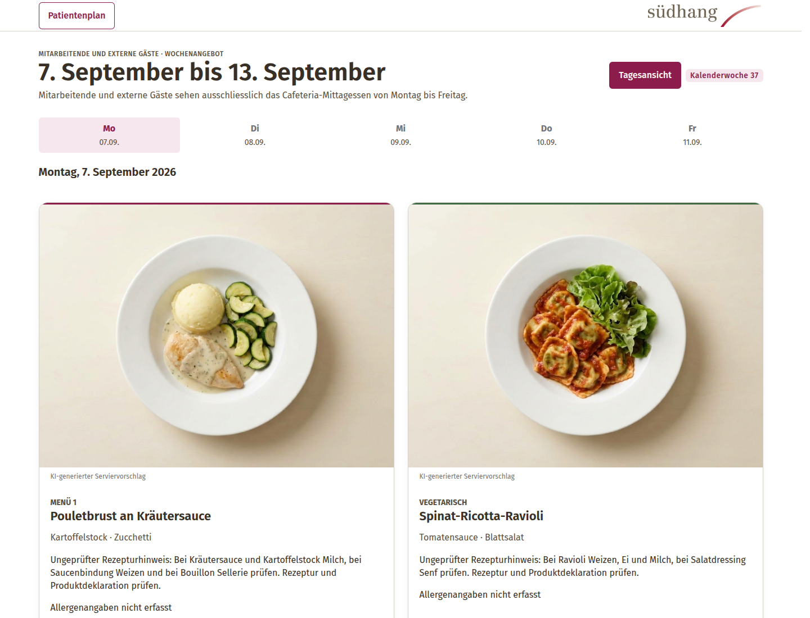

# Menüplanung Klinik Südhang – Patienten und Cafeteria

**Status:** Entwurf, intern technisch geprüft; nicht fachlich abgenommen.  
**Stand:** 13. September 2026.

[GitHub Page](https://joehomeskillet.github.io/Dishboard/) · [Live-Instanz](https://dishboard.joelduss.xyz)



Das Paket modelliert zwei getrennte Publikationskanäle:

| Kanal | Zeitraum und Mahlzeiten | Menüarten | Kosten |
|---|---|---|---|
| Patienten | Montag bis Sonntag, Mittag und Abend | Menü 1 und Vegetarisch | keine Kosteninformation im Kanal |
| Cafeteria | Montag bis Freitag, nur Mittag | Menü 1 und Vegetarisch | Mitarbeitende und Externe |

## Agentische Softwareentwicklung

Dishboard wird durch orchestrierte KI-Coding-Agenten unter menschlicher Steuerung entwickelt. Claude Code (Anthropic) fungiert als Orchestrator: er plant, zerlegt Aufträge in Work Packages, verifiziert Ergebnisse unabhängig, integriert und merged. Merge und Deploy erfolgen nur nach menschlicher Freigabe.

Sechs Worker-Lanes setzen die Work Packages um: OpenAI Codex, Cursor Agent, Google Antigravity (Gemini), Grok Build, MiniMax über OpenCode und Cline. Vor jedem Merge finden unabhängige Cross-Vendor-Reviews (Cursor, Gemini, Grok) und Open Code Review statt.

- **Isolation:** Jedes Work Package läuft in einem eigenen Git-Worktree und Branch. Worker committen; pushen, mergen und deployen nie.
- **Regeln:** Ein gemeinsamer Ausführungsvertrag für alle Tools, `AGENTS.md` als Single Source of Truth, Work-Package-JSONs mit Dateibesitz und Routing-Belegen.
- **Gates:** pytest-Suite (rund 1 900 Testfunktionen, über 4 800 Testfälle im Vollgate mit PostgreSQL und Redis), Ruff, Mypy, Playwright-Browser-Gates bei 390/1440/1920/3840 px, Paketvalidator mit SHA-256-Manifest, GitNexus-Impact-Analyse vor Symboländerungen.
- **Zahlen:** 860 Commits auf `main` (Stand 13.09.2026) unter dem gemeinsamen Git-Benutzer `agent`; produktiv seit 2. September 2026. Menübilder sind KI-generierte Serviervorschläge (so auch in der App beschriftet).
- **Mensch:** Auftrag, Priorisierung, Freigaben und fachliche Abnahme bleiben beim Menschen; die fachliche Abnahme ist laut README noch offen.

Belege: `docs/superpowers/backlog-0909/` (WP-Pläne, `execution-contract.md`, `file-leases.json`, `routing-receipts.json`), `.claude/evidence/` (Gate-Logs und Cross-Reviews), `AGENTS.md`.

## Dokumentation

Der [Dokumentationswegweiser](docs/README.md) führt zu allen aktuellen
Spezifikationen, Betriebsdokumenten, Schnittstellen und Planungsgrundlagen. Er
trennt geltende Dokumente von Nachweisen und archivierten Arbeitsständen.

## Wichtigste Inhalte

| Pfad | Inhalt |
|---|---|
| `docs/SDD_Klinik_Suedhang_Cafeteria_v3.0.md/.docx` | korrigiertes SDD mit Produktregeln, Informationsarchitektur, Fit-Regeln und Backlog |
| `docs/API.md` | REST-API v1, FHIR R5, MCP-Server und API-Schlüssel |
| `docs/GROK_KRITIK_UMSETZUNG.md` | Punkt-für-Punkt-Umsetzung und verbleibende Nachweise |
| `review/Grok_Kritik_original.txt` | unveränderte Reviewgrundlage |
| `database/` | PostgreSQL-Schema, SQL-Baseline, Seeds, Rechte und statischer Validator |
| `demo/snapshots/` | getrennte publizierte Demo-Revisionen für dieselbe Kalenderwoche |
| `csv/` | je eine Vorlage und ein Beispiel für Patienten und Cafeteria, plus Validator |
| `reference_scaffold/` | Flask-Referenzgerüst mit Website, Druck, API, Backend-Prototypen und vier Signage-Routen |
| `reference_scaffold/dishboard_mcp/` | MCP-Server (stdio) für LLM-Clients |
| `design/prototype/` | elf eigenständige HTML-Prototypen plus Kompatibilitätskopien |
| `design/screenshots/` | 14 primäre Screenshots plus drei Kompatibilitätskopien; 18 Live-Screenshots in `design/screenshots/live` (Stand 13.09.2026) |
| `architecture/` | System-, Daten-, Auth- und CSV-Fluss als DOT, PNG und SVG |
| `deployment/` | Docker Compose, Secrets, Backup/Restore, Healthchecks und Runbook |
| `entra/` | drei App-Rollen, Gruppenbeispiel und PowerShell-Bereitstellung |

## Feste URLs

| Zweck | Route |
|---|---|
| Patienten heute / Woche | `/patienten/heute/` · `/patienten/wochenplan/` |
| Cafeteria heute / Woche | `/cafeteria/heute/` · `/cafeteria/wochenangebot/` |
| Patienten Druck | `/druck/patienten/woche` |
| Cafeteria Druck | `/druck/cafeteria/woche` |
| Signage Cafeteria Tag / Woche | `/signage/cafeteria/tag` · `/signage/cafeteria/woche` |
| Signage Patienten Tag / Woche | `/signage/patienten/tag` · `/signage/patienten/woche` |
| Veröffentlichte API | `/api/v1/published/cafeteria` · `/api/v1/published/patienten` |
| API-Status und Dokumentation | `/api/v1/status` · `/api/v1/docs` · `/api/v1/openapi.json` |
| FHIR | `/fhir/metadata` · `/fhir/NutritionProduct` · `/fhir/Composition` |
| Admin: API & Schlüssel | `/admin/api` |
| Anmeldung und Authentifizierung | `/auth/login` · `/auth/local` · `/auth/logout` |
| Admin- und Operator-Backend | `/admin/cafeteria` · `/admin/patienten` · `/admin/import-preview` · `/admin/import` · `/admin/export/<profile>.csv` |
| Health-Checks | `/health/live` · `/health/ready` |

Öffentliche Player- und API-Routen akzeptieren keine Query-Parameter. Der Patienten-Wochenplayer ist für 3840 × 2160 festgelegt; die 1920 × 1080-Datei ist nur eine Vorschau.

## Anmeldung und lokale Konten

Entra und lokal provisionierte Konten können parallel genutzt werden. Es gibt kein Self-Signup; der Code-Default ist `LOCAL_AUTH_ENABLED=false`, aber die produktive `.env.example` setzt `LOCAL_AUTH_ENABLED=true` und `ENTRA_ENABLED=false`. Produktion benötigt getrennte, nicht voreingestellte Credentials: `DATABASE_URL` für `cafeteria_app` und `POSTGRES_AUTH_ISSUER_PASSWORD_FILE` als ausschließliche Quelle für das Issuer-Passwort. `AUTH_ISSUER_DATABASE_URL` darf nicht persistent konfiguriert werden; die Issuer-Verbindung wird erst im Prozess aus dem Password-File abgeleitet. `SESSION_REDIS_URL` ist für produktive Sessions und die fail-closed Login-Rate-Limitierung zwingend.

Beim ersten Start wird der erste lokale Administrator über die Migrate-Verbindung (Owner-Rolle) interaktiv provisioniert:

```bash
cd deployment
docker compose run --rm --no-deps migrate python /app/manage.py bootstrap-local-admin --username <name> --display-name "<angezeigter Name>"
```

Der Befehl fragt das Passwort zweimal interaktiv ab oder liest aus `DISHBOARD_BOOTSTRAP_PASSWORD_FILE` (Mode 0400). Danach leitet `/auth/login` auf `/auth/local` um.

Weitere Benutzer werden von einem verifizierten Administrator provisioniert:

```bash
cd reference_scaffold
python manage.py provision-local-user --actor admin@example.invalid --username kueche.admin --display-name "Küche Admin" --role Cafeteria.Admin
python manage.py set-local-password --actor admin@example.invalid --username kueche.admin
python manage.py disable-local-user --actor admin@example.invalid --username kueche.admin
```

Die Passwortbefehle fragen das Passwort verdeckt zweimal ab; ein Passwort-CLI-Argument existiert nicht. Zulässige Rollen sind exakt `Cafeteria.Editor`, `Cafeteria.Publisher` und `Cafeteria.Admin`.

## Offline prüfen

```bash
python database/validate_schema.py
python csv/validate_menu_csv.py csv/menu_patient_example.csv --json
python csv/validate_menu_csv.py csv/menu_cafeteria_example.csv --json
python deployment/validate_compose.py
cd reference_scaffold && python -m pytest -q tests
cd ..
python tools/validate_package.py --offline
```

Die Test-Suites verlangen `TEST_DATABASE_URL` und `TEST_REDIS_URL`; ohne sie werden ~2000 Tests übersprungen. `python tools/validate_package.py` verlangt das Live-Gate; `--offline` läuft mit Warnung.

## Artefakte neu erzeugen

```bash
python tools/capture_screenshots.py
python tools/build_sdd_docx.py
python tools/build_manifest.py
python tools/build_manifest.py --verify
```

Für einen abweichenden Browserpfad akzeptiert das Screenshot-Skript `--browser-path /pfad/zu/chromium`.

## Demo mit Docker Compose

```bash
cd deployment
./bootstrap.sh
# .env wird von bootstrap.sh angelegt; für lokale Demo optional APP_HOST_PORT=8080 setzen.
# Nur für die Demo: DEMO_MODE=true und SEED_DEMO=true.
docker compose config
docker compose up --build -d
docker compose ps
```

Entra-Login im Tenant, produktiver Restore, Sichtprüfung am 4K-Player und die fachliche Abnahme bleiben offene Nachweise; Live-PostgreSQL, Compose-Betrieb und der Küchenworkflow sind seit 2. September 2026 auf https://dishboard.joelduss.xyz im Betrieb.
