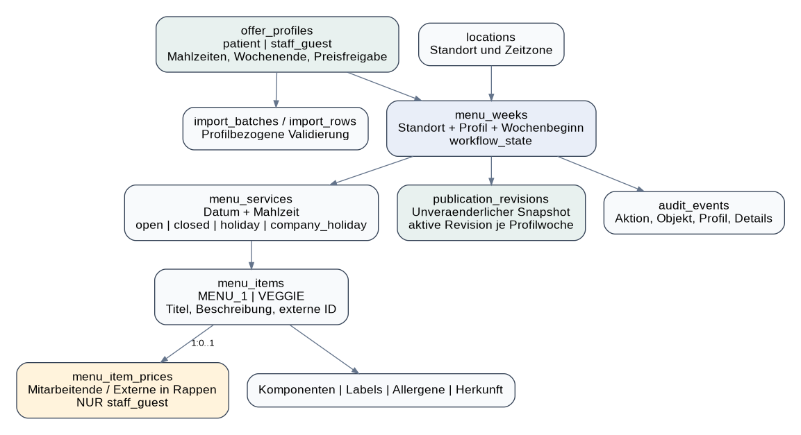
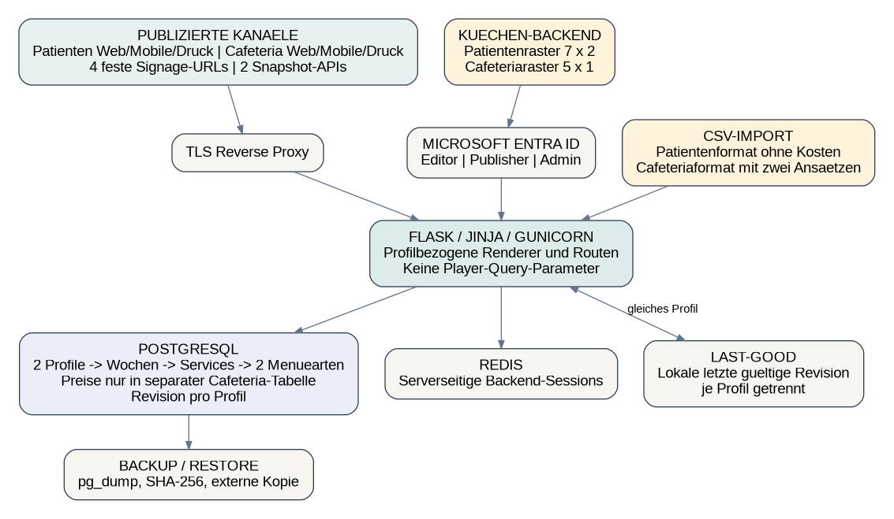
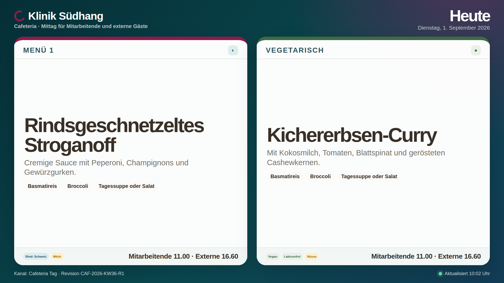
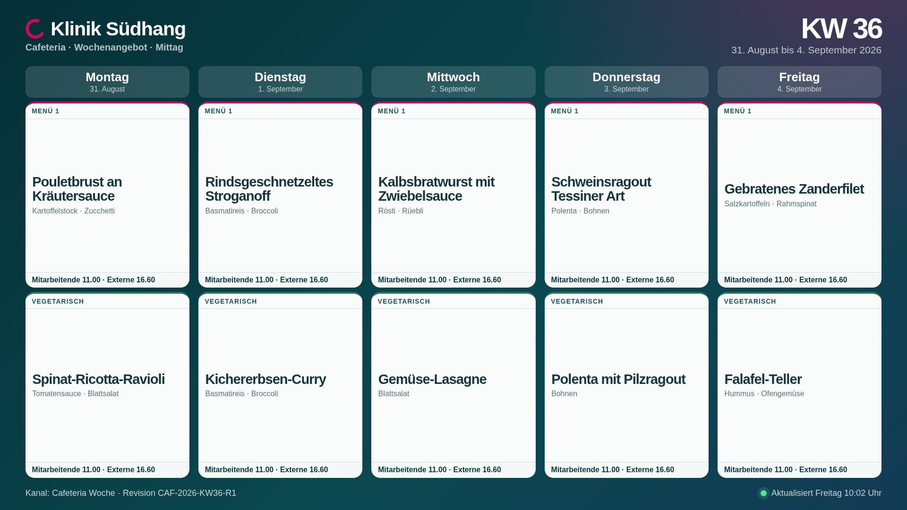
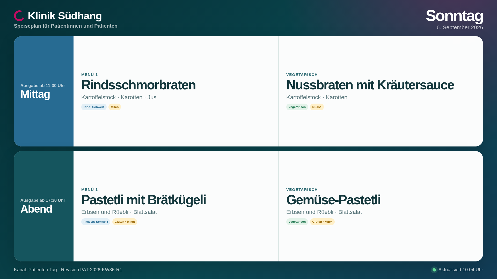
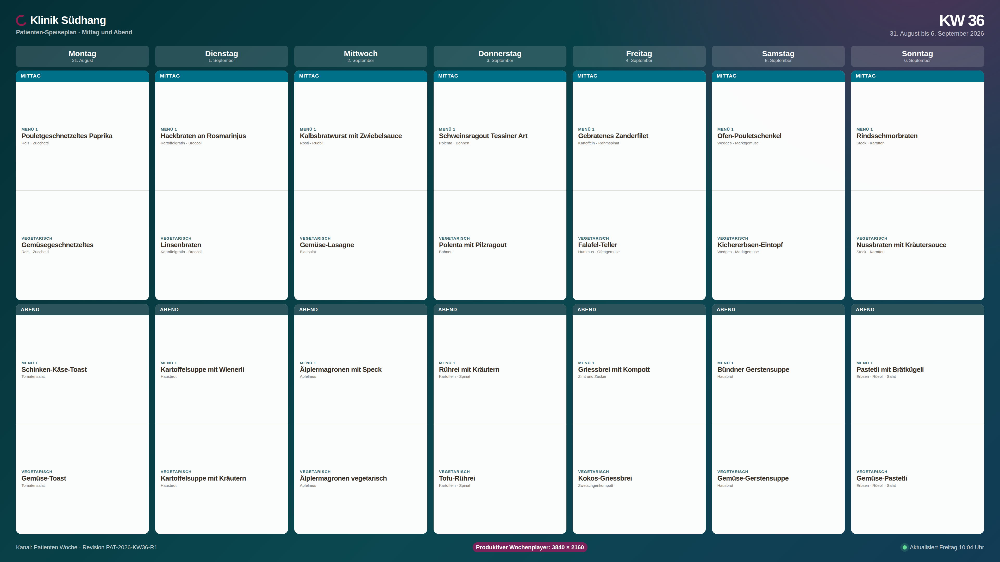
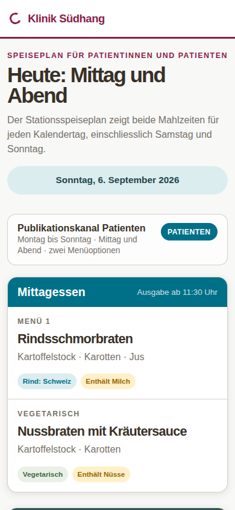
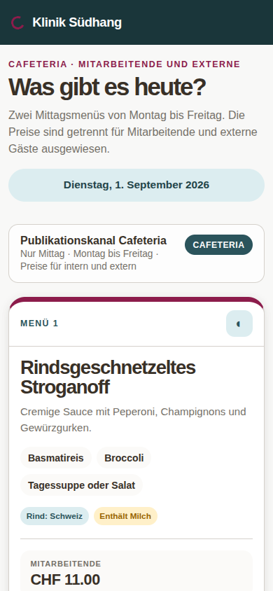

# Dokumentstatus und verbindliche Produktregeln

| Feld | Festlegung |
|---|---|
| Status | **Entwurf, intern technisch geprüft; nicht fachlich abgenommen** |
| Zweck | Implementierungsgrundlage für zwei getrennte Menüpläne und vier feste Signage-Flächen |
| Fachverantwortung | Küche / Hotellerie |
| Technische Verantwortung | ICT / Webadministration |
| Stack | Flask, Jinja, SQLAlchemy, PostgreSQL, Redis, Gunicorn, Docker Compose |
| Zeitzone | Europe/Zurich |
| Referenzwoche | Montag, 31. August bis Sonntag, 6. September 2026 |

## Regel 1: Zwei Profile, zwei Publikationsstränge

| Profil | Zeitraum | Mahlzeiten | Menüarten | Kostenangaben | Eigene Kanäle |
|---|---|---|---|---|---|
| Patienten | Montag bis Sonntag | Mittag und Abend | Menü 1 und Vegetarisch | **Nicht vorhanden** | Mobile/Web, Druck, Signage Tag, Signage Woche, Snapshot |
| Cafeteria für Mitarbeitende und Externe | Montag bis Freitag | Nur Mittag | Menü 1 und Vegetarisch | Mitarbeitende und Externe in CHF | Mobile/Web, Druck, Signage Tag, Signage Woche, Snapshot |

Für den Patientenkanal existiert keine Kosteninformation: weder in Formular, CSV, Datenbankpreiszeile, Snapshot, JSON, HTML noch als ausgeblendetes Element. Die Cafeteria zeigt beide Ansätze sichtbar und eindeutig beschriftet.

## Regel 2: Jede Ausgabe ist profilbezogen

Jede Ausgabe wird aus **Angebotsprofil × Kalendertag × Mahlzeit × Publikationsrevision** gebildet. Ein Patientenplayer darf nie auf Cafeteria-Daten zurückfallen. Ein Cafeteriaplayer darf am Wochenende nie Patientenessen anzeigen. Entwürfe sind nie öffentlich.

## Regel 3: Zwei feste Backend-Raster

- Patienten: 7 Tage × Mittag und Abend × zwei Menüarten.
- Cafeteria: 5 Werktage × Mittag × zwei Menüarten × zwei Kostenansätze.
- Schliessungen und Feiertage gelten je Profil, Tag und Mahlzeit.
- Gemeinsame Gerichtsvorlagen sind erlaubt; beim Einfügen in einen Patientenplan werden Kosteninformationen verworfen und nicht auf null gesetzt.

## Regel 4: Vier feste Player-Flächen

| Player | Inhalt | Produktionsauflösung |
|---|---|---:|
| `/signage/cafeteria/tag` | Heutiger Werktag, Mittag, zwei Menüarten, zwei Kostenansätze | 1920 × 1080 |
| `/signage/cafeteria/woche` | Montag bis Freitag, 5 × 2 Menükarten, Kostenansätze | 1920 × 1080 |
| `/signage/patienten/tag` | Heutiger Kalendertag, Mittag und Abend, je zwei Menüarten | 1920 × 1080 |
| `/signage/patienten/woche` | Montag bis Sonntag, Mittag und Abend, je zwei Menüarten | **3840 × 2160** |

Die Player haben keine Navigation, kein Login, kein Cookie-Banner, keinen Profilumschalter und keine öffentlichen Datumsparameter. Standardaktualisierung: 300 Sekunden. Bei Datenbankfehlern wird die letzte lokal gespeicherte gültige Revision des gleichen Profils verwendet.

# Diagnose des Ausgangspakets in zehn Sätzen

1. Die Datenbank wurde gewechselt, der Klinikbetrieb war aber nicht vollständig modelliert.
2. Eine Cafeteria-Tagesanzeige ist kein Speise-Wegeleitsystem für Patientinnen und Patienten.
3. Patienten benötigen Montag bis Sonntag sowohl Mittag- als auch Abendessen.
4. Auf jedem Patienten-Screen müssen zwei Menüarten erscheinen.
5. Patienten bezahlen diese Mahlzeiten nicht; deshalb darf in ihrem Kanal kein Kostenfeld existieren.
6. Mitarbeitende und externe Gäste benötigen dagegen sichtbare, getrennte Kostenansätze.
7. Eine einzige Signage-URL kann vier fachlich verschiedene Player-Flächen nicht korrekt vertreten.
8. Eine Schliessung auf Tagesebene ist zu grob, weil Profil und Mahlzeit unterschiedlich betroffen sein können.
9. Statische Header-, Syntax- und Bildprüfungen sind keine fachliche oder betriebliche Abnahme.
10. PostgreSQL, Compose und ein 16:9-Prototyp sind Infrastruktur; Produktfortschritt entsteht erst durch getrennte Raster, Publikationen, Player und Abnahmetests.

# Executive Summary

Das Rework ersetzt die bisherige Einheitswoche durch zwei fachlich getrennte Profile. Der Patientenplan umfasst sieben Kalendertage, Mittag und Abend sowie je zwei Menüarten. Er enthält strukturell keine Kosteninformationen. Der Cafeteriaplan umfasst fünf Werktage, nur Mittag, je zwei Menüarten und getrennte Ansätze für Mitarbeitende und externe Gäste.

Die Publikation erfolgt pro Profil in einen eigenen unveränderlichen Snapshot. Tages- und Wochenrenderer eines Profils lesen dieselbe Revisions-ID. Vier feste Player-URLs verhindern, dass Yodeck oder ein Browser über Query-Parameter das Profil oder Datum umschaltet. Für den Patienten-Wochenplayer wird 4K verbindlich festgelegt; die 1080p-Ausgabe bleibt ausschliesslich eine Layoutvorschau, weil 14 Mahlzeitenblöcke mit insgesamt 28 Menüoptionen sonst nicht seriös lesbar sind.

Das Paket enthält ein PostgreSQL-Schema mit Constraints und Triggern, profilbezogene CSVs, getrennte Demo-Snapshots, ein Flask-Referenzgerüst, statische Prototypen, 14 primäre Referenzscreenshots, Compose- und Entra-Artefakte sowie automatisierte Offline-Vertragsprüfungen. Es ist weiterhin kein fachlich abgenommenes Produktionssystem: vollständige Bearbeitungs- und Publikationsoberflächen, Live-PostgreSQL-Ausführung, Entra-Tenant-Test, Backup/Restore und Staging-E2E bleiben auszuführen.

# Befunde aus der Kritik und Status im Rework

| Befund | Schwere | Nachweis im Ausgangspaket | Umsetzung im Rework |
|---|:---:|---|---|
| Ein Profil für alle Zielgruppen | P0 | Eine Woche, eine Publikationsfamilie | `offer_profiles`, profilbezogene `menu_weeks`, zwei Snapshots und getrennte Routen |
| Kein Patienten-Abendessen | P0 | Beispieldaten nur `LUNCH` | Patientenprofil erlaubt `LUNCH` und `DINNER`; Demo enthält 14 Mahlzeitenblöcke |
| Wochenende nur technisch gedacht | P0 | MVP Mo–Fr | Patientenraster Mo–So; Cafeteria wird auf Mo–Fr begrenzt |
| Kosten vergiften Patientenkanal | P0 | Kosten auf Woche/Item und gemeinsames CSV | Eigene Tabelle `menu_item_prices`; Trigger verbietet Patientenpreise; Patienten-CSV und Snapshot ohne Kosten-Schlüssel |
| Eine Signage statt vier | P0 | Eine 1920×1080-Tagesfläche | Vier feste Routen, vier Templates, fünf Signage-Screenshots inklusive Schliessungsfläche |
| Schliessung zu grob | P0 | Tagesflag ohne Profil/Mahlzeit | `menu_services.service_state` pro Woche/Profil/Datum/Mahlzeit |
| Eine aktive Publikation | P0 | Ein Snapshot für die Woche | Revision ist an die profilbezogene Woche gebunden; aktive Revision pro Profil und Woche |
| Freies `?date=` am Player | P0 | Demo-Player mit Datumsparameter | Signage und API lehnen sämtliche Query-Parameter ab |
| Demo mit Vollrollen | P0 | Risiko im Gerüst | Demo-Benutzer erhält nur Editor und Publisher; Produktion verweigert Demo-Konfiguration |
| CSRF nur als Prosa | P0 | Schreibpfade nicht einheitlich geschützt | Vorhandener Upload-POST prüft Token; weitere Schreiboberflächen sind noch nicht implementiert und damit nicht als erledigt markiert |
| Alembic behauptet, SQL geliefert | P0 | Eine SQL-Datei als angebliche Migration | Anspruch entfernt; `0001_initial_postgresql.sql` ist ausdrücklich die versionierte SQL-Baseline |
| Publisher darf nicht korrigieren | P1 | Unpraktische Rollenmatrix | Publisher enthält die Editor-Fähigkeiten |
| CMS-Überbau | P1 | Leases, Presence, fünf Rollen, Merge-UI | MVP reduziert auf drei Rollen, zwei Raster, profilbezogene Publikation und Auditgrundlage |
| 21-Spalten-Einheits-CSV | P1 | Profil und Mahlzeitenmodell fehlen | Zwei Küchenformate: 17 Spalten Patienten, 19 Spalten Cafeteria |
| 14-Slot-Fit ungeklärt | P1 | Keine Patienten-Wochensignage | 4K als Mindestauflösung; 1080p nur Vorschau |
| Backup/Restore und Compose nicht live geprüft | P2 | Strukturprüfung statt Betrieb | Ehrlich als offen dokumentiert; Runbook und Prüfkommandos enthalten |
| Workerzahl als Reifeargument | P2 | Mehrere Worker als Skalierungsbeleg | Zwei Worker sind nur Betriebsstandard, kein Qualitätsnachweis |

# Informationsarchitektur

## Öffentliche Website und Mobile

| Profil | Tagesansicht | Wochenansicht | Verhalten |
|---|---|---|---|
| Cafeteria | `/cafeteria/heute/` | `/cafeteria/wochenangebot/` | Mo–Fr, nur Mittag, zwei Menüarten, beide Kostenansätze; Sa/So geschlossen |
| Patienten | `/patienten/heute/` | `/patienten/wochenplan/` | Mo–So, Mittag und Abend, je zwei Menüarten, ohne Kosteninformationen |

Beide Website-Familien besitzen Navigation. Die Mobile-Darstellung verwendet dieselben URLs und bricht in eine vertikale Lesereihenfolge um. Die beiden Kanäle bleiben visuell und textlich gekennzeichnet.

## Druck

| Profil | Route | Inhalt |
|---|---|---|
| Cafeteria | `/druck/cafeteria/woche` | Mo–Fr, Mittag, zwei Menüarten, Mitarbeitende/Externe |
| Patienten | `/druck/patienten/woche` | Mo–So, Mittag und Abend, je zwei Menüarten, ohne Kosteninformationen |

## Signage

| Route | Leer- und Fehlerzustand |
|---|---|
| `/signage/cafeteria/tag` | Wochenende, Feiertag oder Schliessung: Vollfläche „Cafeteria geschlossen“; kein Rückfall auf Freitag |
| `/signage/cafeteria/woche` | Nur fünf Werktage; fehlende Revision: neutrale Nichtverfügbarkeitsfläche |
| `/signage/patienten/tag` | Fehlt eine Patientenrevision, werden keine Cafeteriadaten angezeigt |
| `/signage/patienten/woche` | Fehlt eine Patientenrevision, bleibt der Kanal leer und klar bezeichnet |

## Backend

| Route | Raster |
|---|---|
| `/admin/cafeteria` | 5 Tage × Mittag × Menü 1/Vegetarisch × Mitarbeitende/Externe |
| `/admin/patienten` | 7 Tage × Mittag/Abend × Menü 1/Vegetarisch; kein Kostenfeld |
| `/admin/import-preview` | Profilformat prüfen; keine gemischten Profile in einer Datei |

## API

| Route | Snapshot |
|---|---|
| `/api/v1/published/cafeteria` | Nur `staff_guest`, inklusive Kosten |
| `/api/v1/published/patienten` | Nur `patient`, ohne Kosten-Schlüssel |

# Layoutskizzen

## Cafeteria-Woche, 1920 × 1080

```text
┌────────────────────────────────────────────────────────────────────────────┐
│ Cafeteria · KW 36 · Mitarbeitende und externe Gäste                       │
├────────────┬────────────┬────────────┬────────────┬────────────┤
│ Montag     │ Dienstag   │ Mittwoch   │ Donnerstag │ Freitag    │
├────────────┼────────────┼────────────┼────────────┼────────────┤
│ Menü 1     │ Menü 1     │ Menü 1     │ Menü 1     │ Menü 1     │
│ Gericht    │ Gericht    │ Gericht    │ Gericht    │ Gericht    │
│ MA / Ext.  │ MA / Ext.  │ MA / Ext.  │ MA / Ext.  │ MA / Ext.  │
├────────────┼────────────┼────────────┼────────────┼────────────┤
│ Vegetar.   │ Vegetar.   │ Vegetar.   │ Vegetar.   │ Vegetar.   │
│ Gericht    │ Gericht    │ Gericht    │ Gericht    │ Gericht    │
│ MA / Ext.  │ MA / Ext.  │ MA / Ext.  │ MA / Ext.  │ MA / Ext.  │
└────────────┴────────────┴────────────┴────────────┴────────────┘
```

## Patienten-Woche, 3840 × 2160

```text
┌──────────────────────────────────────────────────────────────────────────────┐
│ Patienten-Speiseplan · Montag bis Sonntag · Mittag und Abend                │
├─────────┬─────────┬─────────┬─────────┬─────────┬─────────┬─────────┤
│ Mo      │ Di      │ Mi      │ Do      │ Fr      │ Sa      │ So      │
├─────────┼─────────┼─────────┼─────────┼─────────┼─────────┼─────────┤
│ MITTAG: Menü 1 + Vegetarisch in jedem Tagesfeld                              │
├─────────┼─────────┼─────────┼─────────┼─────────┼─────────┼─────────┤
│ ABEND:  Menü 1 + Vegetarisch in jedem Tagesfeld                              │
└─────────┴─────────┴─────────┴─────────┴─────────┴─────────┴─────────┘
```

# Fit-Regeln

| Fläche | Mindestschrift | Inhaltsgrenzen | Entscheidung |
|---|---:|---|---|
| Cafeteria Tag 1080p | Titel 38 px; Details 24 px; Kosten 26 px | Titel max. 46 Zeichen/2 Zeilen; Details max. 70 Zeichen/2 Zeilen | Zwei Karten ohne Scrollen |
| Cafeteria Woche 1080p | Gericht 23 px; Details/Kosten 17 px | Gericht max. 36 Zeichen/2 Zeilen; Details max. 48 Zeichen/2 Zeilen | 5 × 2 Slots |
| Patienten Tag 1080p | Gericht 32 px; Details 22 px | Gericht max. 42 Zeichen/2 Zeilen; Details max. 62 Zeichen/2 Zeilen | Zwei Mahlzeitenblöcke mit je zwei Optionen |
| Patienten Woche 4K | Tag 34 px; Mahlzeit 25 px; Gericht 24 px; Details 17 px | Gericht max. 36 Zeichen/2 Zeilen; Details max. 48 Zeichen/2 Zeilen | 7 × 2 Mahlzeitenblöcke, 28 Optionen, kein Scrollen |
| Patienten Woche 1080p | Nicht zur Produktion freigegeben | Nur Referenzvorschau | Lesedichte unterschreitet den akzeptierten Abstand |
| Mobile | Text mindestens 16 CSS-px | Pro Tag zuerst Mittag, dann Abend; pro Mahlzeit Menü 1, dann Vegetarisch | Vertikale Liste statt verkleinertem Desktop-Grid |

Überlange Texte blockieren die Publikation oder verlangen eine gekürzte Anzeigenbezeichnung. Automatische 11-px-Verkleinerung, Laufschrift und Scrollen sind nicht zulässig.

# Fachliches Datenmodell



## Kernelemente

- `offer_profiles` definiert `patient` und `staff_guest` samt erlaubten Mahlzeiten, Wochenendregel und Kostenfreigabe.
- `menu_weeks` ist eindeutig je Standort, Profil und Wochenbeginn.
- `menu_services` bildet Datum, Mahlzeit und Zustand `open`, `closed`, `holiday` oder `company_holiday` ab.
- `menu_items` enthält genau eine Zeile pro Menüart und Service.
- `menu_item_prices` ist eine separate 1:1-Tabelle und nur für Cafeteria-Items zulässig.
- `publication_revisions` enthält unveränderliche profilbezogene JSON-Snapshots.
- Allergene, Labels, Komponenten und Herkunft sind gemeinsame Fachstammdaten.

## Durch die Datenbank erzwungene Regeln

| Unzulässige Kombination | Reaktion |
|---|---|
| Cafeteria + Abendessen | Triggerfehler |
| Cafeteria + Samstag/Sonntag | Triggerfehler |
| Patienten-Item + Kostenzeile | Triggerfehler |
| Offener Service ohne genau zwei Menüarten bei Publikation | Publikation wird abgelehnt |
| Patienten-Snapshot mit kostenbezogenem Schlüssel oder Kostenwert | Publikation wird abgelehnt |
| Cafeteria-Snapshot ohne beide Kostenansätze | Publikation wird abgelehnt |
| Gemischtes Profil im Snapshot | Publikation wird abgelehnt |
| Leere `external_id` oder leerer Gerichtstitel | Constraint-Fehler |

# Publikation und Snapshot-Isolation

1. Die Küche bearbeitet einen Entwurf innerhalb genau eines Profils.
2. Vor der Freigabe prüft die Anwendung Vollständigkeit, zwei Menüarten, Profil/Mahlzeit/Tag, Allergendeklaration und Layoutgrenzen.
3. Der Snapshot wird vollständig vor der kurzen Datenbanktransaktion erstellt.
4. Die Transaktion sperrt die profilbezogene Woche, speichert eine neue Revision und zieht die vorherige aktive Revision dieses Profils zurück.
5. Cafeteria- und Patientenpublikation beeinflussen einander nicht.
6. Tages- und Wochenrenderer laden dieselbe aktive Revisions-ID ihres Profils.
7. Der Player speichert nach erfolgreichem Laden eine letzte gültige Kopie je Profil. Ein Datenbankfehler darf keinen Profilwechsel verursachen.

# CSV für die Küche

| Format | Zeilen pro vollständiger Woche | Kostenfelder |
|---|---:|---|
| `menu_patient_template.csv` | 28 | Keine |
| `menu_cafeteria_template.csv` | 10 | `preis_mitarbeitende_chf`, `preis_externe_chf` |

Gemeinsame Kernfelder: `datum`, `wochentag`, `mahlzeit`, `menueart`, `external_id`, `titel`, `beschreibung`, `beilagen`, `labels`, `allergene_enthaelt`, `allergene_spuren`, `herkunft`, `hinweis`, `zustand`, `zustand_text`.

Eine Datei enthält genau ein Profil und eine Kalenderwoche. Patientenimporte mit Kostenfeldern werden abgelehnt. Cafeteriaimporte mit Abendessen oder Wochenende werden abgelehnt. Formelführende Zellen werden beim Export Excel-sicher neutralisiert.

# Rollen und Anmeldung

Das Backend unterstützt zwei Auth-Provider: Microsoft Entra ID (optional, produktiv) und lokale Benutzer (standardmäßig aktiviert).

## Lokale Benutzer

Die erste lokale Administration wird mit `python manage.py bootstrap-local-admin --username X --display-name Y` auf der Owner-Datenbankverbindung bereitgestellt. Das Passwort wird zweimal interaktiv abgefragt; der Compose-Migrate-Service übernimmt keine externe Passwortdatei. Weitere Benutzer werden von verifizierten Administratoren provisioniert: `python manage.py provision-local-user --actor <actor-identifier> --username ... --display-name ... --role Cafeteria.Editor|Publisher|Admin`. Der Identifier ist ein aktiver Benutzername, eine E-Mail-Adresse oder ein `preferred_username`. Passwort-Änderungen und Deaktivierungen erfolgen ebenfalls über diese verifizierten Administratoren.

## Microsoft Entra ID (Optional)

Bei `ENTRA_ENABLED=true` wird der Authorization Code Flow mit Single-Tenant-Setup genutzt. Nur zugewiesene Benutzer oder Gruppen erhalten Backendzugriff. Rollen werden aus dem `roles`-Claim gelesen und auf lokale Rollen synchronisiert. Entra ist deaktiviert, bis Tenant-ID, Client-ID und Client Secret konfiguriert sind.

## Rollen

| Rolle | Fähigkeiten |
|---|---|
| `Cafeteria.Editor` | Beide Raster erfassen, CSV prüfen/importieren, Vorschau und Export |
| `Cafeteria.Publisher` | Alle Editor-Fähigkeiten plus profilbezogene Validierung, Publikation und Rückzug |
| `Cafeteria.Admin` | Vollzugriff, Rollenabbildung, Audit und Diagnose |

Die Anwendung nutzt Microsoft Entra ID im Authorization Code Flow. Nur zugewiesene Benutzer oder Gruppen erhalten Backendzugriff. Öffentliche Website-, Druck-, API- und Signage-Routen benötigen kein Login. Der Demo-Modus ist in `APP_ENV=production` technisch verboten.

# Sicherheit

- Authentifizierung lokal oder optional über Entra; serverseitige Rollen-Autorisierung; lokale Passwörter gehasht (scrypt/pbkdf2); Entra-Rollen synchronisiert aus der `roles`-Claim.
- Sichere serverseitige Session in Redis; Cookie `Secure`, `HttpOnly`, `SameSite=Lax`.
- CSRF-Token für jeden implementierten schreibenden Browserpfad.
- Uploadlimit, Dateityp- und CSV-Inhaltsprüfung.
- Player und veröffentlichte API lehnen Query-Parameter ab.
- Keine Geheimnisse in Git, `.env`, Healthcheck-Befehlszeilen oder Logs.
- Content-Security-Policy, Frame-Policy und Proxy-Vertrauen werden zentral konfiguriert.
- Patientenvorlagen und -snapshots werden automatisiert auf Kostenbegriffe und Kosten-Schlüssel geprüft.
- Kein stiller Fallback auf ein anderes Profil oder einen alten Wochentag.
- Auditereignisse sind nach dem Schreiben nicht änderbar.

# Betrieb



## Datenbank und Schema

PostgreSQL 18.6 mit Schema-Version 12 (Migrationen 0001–0009 mit SHA-256-Validierung). SQL-Baseline (`database/schema.sql`) und `0001_initial_postgresql.sql` sind byteidentisch. Alle Triggers, Funktionen und Constraints sind in der SQL-Baseline definiert; das Paket nutzt kein Alembic.

## Docker-Services

| Dienst | Aufgabe |
|---|---|
| `db` | PostgreSQL 18.6 mit Constraints und Audit |
| `redis` | Redis 7.4 für Serverseitige Sessions (UID 999:1000) |
| `migrate` | Versionierte SQL-Baseline, Seed, Permissions und Capability-Reset (UID 10001) |
| `app` | Flask 3 + Gunicorn 26 auf Container-Port 8000, veröffentlicht am Host auf 127.0.0.1:8789 (UID 10001); zwei Worker sind Betriebswert, kein Skalierungsnachweis |
| `backup` | Periodischer `pg_dump` mit Secrets-Ausschlüssen, Hash und Manifest |
| `restore` | Manueller Restore im Compose-Profil `ops`; Kandidaten-DB, Lease-Akquise, Lifecycle-Atomarität |

## Deployment

Netzwerk 10.213.0.0/24 (ausserhalb Docker-Defaults 172.16.0.0/12 und 192.168.0.0/16) mit Gateway 10.213.0.1 und optionalem Compose-Caddy-Overlay auf 10.213.0.10. App hat keine feste interne IP; Host-Proxy erreicht sie über Loopback-Port 127.0.0.1:8789.

Secrets als 0700-root-Verzeichnis mit 0444-Dateien pro Service (kein `.env`, kein Git). Image-ID fixiert als APP_IMAGE=sha256:<64hex> (kein Registry-Digest, kein Tag). Bootstrap-Phase mit `APP_ENV=migration` erhält nur PostgreSQL-Secrets. Healthchecks nutzen Shell-Ausführung ohne Secrets als Kommando-Argumente.

Öffentliche Player aktualisieren alle 300 Sekunden. Der Reverse Proxy (Caddy) terminiert TLS und proxyt auf 127.0.0.1:8789. Nur das Gateway 10.213.0.1 darf `X-Forwarded-For` liefern. Backupkopien müssen ausserhalb des Docker-Hosts repliziert werden.


# Welle 3: Labels, Allergene und Branding (umgesetzt)

Die folgenden Features gehören zur umgesetzten Welle 3.

## Allergendeklaration und Labels

Gerichte erhalten Felder für:

- **Labels**: Checkboxgruppe mit den Seed-Optionen Vegetarisch (`VEGETARIAN`), Vegan (`VEGAN`), laktosefrei (`LACTOSE_FREE`) und glutenfrei (`GLUTEN_FREE`)
- **Allergene enthält**: Checkboxgruppe für bekannte Allergene
- **Allergene Spuren**: Checkboxgruppe für mögliche Kreuzverunreinigungen
- **Herkunft**: wiederholte Segmente mit genau einem `=` pro Segment, z. B. `Zutat=CH|Zutat2=DE`
- **Review-Status**: `not_checked` oder `checked` für jede Menüoption

### Publikations-Gate

Eine Publikation ist nur möglich, wenn jede Menüoption den Review-Status `checked` trägt. Dies sperrt unvollständige Allergendeklarationen fail-closed ein.

### Rendering und Anzeigeformat

Labels, Allergene und Herkunftsangaben werden in allen Kanälen als Pills (Tags) angezeigt:

- **Web und Mobile**: Pills neben oder unter dem Gerichtstitel
- **Signage**: Pills in gerichte-spezifischer Farbe und Schrift
- **Druck**: Pills im Gerichtsdatenblatt
- **API**: Allergen- und Label-Felder im JSON-Snapshot

### Admin-Interface

Das Erfassungs-Formular bietet:

- Eine Checkbox für den Review-Status je Menüoption
- Checkboxgruppen für Allergen- und Label-Kategorien
- Herkunfts-Freitextfeld mit Validierung

## Header und Branding (Welle 3)

Die Header-Navigation ist in Welle 3 umgesetzt:

- **Südhang-Logo**: Oben rechts positioniert
- **Kanalnavigation**: Oben links (Umschalter zwischen Patienten- und Cafeteria-Ansicht)
- **Beilagen-Pills**: Beilagen werden gleich hoch und in der Menüart-Farbe (Menü-1-Farbe oder Vegetarisch-Farbe) gerendert
- **Patienten-Wochenansicht und Druck**: Der Seitentitel zeigt den vollständigen `date_long`-Datumsbereich (z. B. „31. August 2026 bis 6. September 2026") statt nur „Wochenplan"

Diese visuellen Verbesserungen stärken die Markenidentität Klinik Südhang und verbessern die Orientierung im System.

# Prototypen und Referenzscreenshots













# Verifikation und Abnahme

## Im Paket automatisiert geprüft

- Schema-Version 12 mit Migrationen 0001–0009; SQL-Baseline byteidentisch.
- Zwei Profile, 28 Tabellen, fünf Cafeteria-Services, 14 Patienten-Services und 28 Patientenoptionen in den Demo-Daten.
- Patienten-Snapshot und -CSV enthalten keine Kosten-Schlüssel oder Kostenfelder; `cafeteria_app` erhält EXECUTE auf Validator-Funktionen.
- Beide CSV-Beispiele erfüllen ihr jeweiliges Profilformat; Normaliserungsfunktionen prüfen auch Patientenkosten-Homoglyphen.
- Alle Jinja-Templates sind syntaktisch parsebar; getrennte Patienten- und Cafeteria-Templates.
- Vier feste Signage-Routen sind vorhanden und öffentliche Datumsparameter fehlen; Last-Good-Snapshots für Fehlerbetrieb.
- 14 primäre Screenshots und 18 Live-Screenshots mit INDEX.json; Pixelmasse und nichtleerer Bildinhalt geprüft.
- DOT-Diagramme werden als PNG und SVG gerendert.
- Validator (tools/validate_package.py): 2199 passed, 14 skipped (Restore-Drill); alle SDD-, README-, Rolle-, Snapshot-, CSV-, Diagram-Checks OK.

- Schema und SQL-Baseline sind byteidentisch.
- Zwei Profile, fünf Cafeteria-Services, 14 Patienten-Services und 28 Patientenoptionen sind in den Demo-Daten vorhanden.
- Patienten-Snapshot und -CSV enthalten keine Kosten-Schlüssel oder Kostenfelder.
- Beide CSV-Beispiele erfüllen ihr jeweiliges Profilformat.
- Alle Jinja-Templates sind syntaktisch parsebar.
- Vier feste Signage-Routen sind vorhanden und öffentliche Datumsparameter fehlen.
- 14 primäre Screenshots besitzen die erwarteten Pixelmasse.
- DOT-Diagramme werden als PNG und SVG gerendert.

## Vor fachlicher Abnahme zwingend live nachzuweisen

| Test | Akzeptanzkriterium |
|---|---|
| Cafeteria am Sonntag | Geschlossenfläche; kein Patientenessen und kein Freitag-Fallback |
| Patienten am Sonntagabend | Gericht vorhanden; im HTML und JSON keine Kostenbegriffe oder Kostenwerte |
| Cafeteria-Woche | Genau Mo–Fr, nur Mittag, je zwei Menüarten und beide Kostenansätze |
| Patienten-Woche | Genau Mo–So, Mittag und Abend, je zwei Menüarten |
| Profilisolation | Kein Signage-HTML und keine API enthält Daten des anderen Profils |
| Revisionsgleichheit | Tag und Woche desselben Profils liefern dieselbe Revisions-ID |
| Importfehler | Patienten + Kostenfeld sowie Cafeteria + Abend/Wochenende werden abgewiesen |
| Publikationsisolation | Cafeteriapublikation verändert den Patienten-Snapshot nicht |
| 4K-Fit | Patienten-Woche auf realem 4K-Player aus üblicher Betrachtungsdistanz lesbar |
| Fehlerbetrieb | Datenbankunterbruch zeigt letzte gültige Revision desselben Profils |
| Entra | Login, Rollenzuweisung, Entzug und Logout im Südhang-Tenant |
| Backup/Restore | Wiederherstellung in separates Testsystem und fachlicher Smoke-Test |

# MVP-Backlog als User Stories

## US-01 Patienten-Woche

**Als Patientin oder Patient sehe ich Montag bis Sonntag Mittag und Abend sowie jeweils Menü 1 und Vegetarisch.**

Akzeptanz: sieben Tage, 14 Mahlzeitenblöcke, 28 Optionen; Tages- und Wochenansicht; keine Kosteninformation in HTML, JSON, CSV oder Datenmodell des Kanals.

## US-02 Cafeteria-Woche

**Als Mitarbeiter oder externer Gast sehe ich Montag bis Freitag nur das Mittagessen mit zwei Menüarten.**

Akzeptanz: zehn Menükarten; Mitarbeitenden- und Externenansatz pro Karte; Wochenende zeigt geschlossen.

## US-03 Cafeteria-Player

**Als Cafeteria-Player zeige ich Tag oder Woche ausschliesslich aus der Cafeteriarevision.**

Akzeptanz: feste URLs; keine Query-Parameter; Sonntag als Vollfläche geschlossen; gleiche Revision für Tag und Woche.

## US-04 Patienten-Player

**Als Patienten-Player zeige ich Tag oder Woche mit Mittag und Abend sowie zwei Menüarten.**

Akzeptanz: keine Kosteninformation; Tag 1080p; Woche 4K; keine Daten des Cafeteriaprofils.

## US-05 Getrennte Erfassung

**Als Küche erfasse ich Patienten- und Cafeteriaplan in zwei klar getrennten Rastern.**

Akzeptanz: Profil ist vor dem Editieren sichtbar; Patientenraster besitzt keine Kostenfelder; Cafeteriaraster besitzt keine Abend- oder Wochenendzeilen.

## US-06 Harte Fachregeln

**Als System lehne ich unzulässige Kombinationen bereits beim Speichern oder Publizieren ab.**

Akzeptanz: Cafeteria + Abend, Cafeteria + Wochenende, Patient + Kosten und unvollständige zwei Menüarten führen zu verständlicher Fehlermeldung und keiner Teilpublikation.

# Gestrichener oder verschobener Umfang

| Nicht im MVP | Begründung |
|---|---|
| Presence, Bearbeitungs-Leases und Heartbeats | Kein Vorrang vor korrekten zwei Rastern und Publikationen |
| Feldweise Merge-UI | Erst nach realem Konfliktbedarf |
| Fünf Spezialrollen | Drei verständliche Rollen genügen |
| Service Worker und Offline-Editor | Player-Fallback reicht; kein zweiter Synchronisationspfad |
| Datenbank-HA | Betriebskonzept nach realer Verfügbarkeitsanforderung |
| Kasse, Bestellung, Warenwirtschaft | Nicht Teil der Menüpublikation |
| Individuelle Diät- oder Therapieplanung | KIS/EPA-Prozess, nicht öffentlicher Speiseplan |
| Eine Player-URL mit Profilumschalter | Fachlich und betrieblich verboten |
| Kostenwert null im Patientenkanal | Null ist weiterhin eine Kosteninformation |
| Zweites normalisiertes CSV-Bundle als Küchenweg | Flat-CSV je Profil ist ausreichend; Bundle höchstens administrativ |

# Anforderungsstatus

| MUSS-Anforderung | Spezifiziert | Im Gerüst/Artefakt | Automatisiert geprüft | Fachlich abgenommen |
|---|:---:|:---:|:---:|:---:|
| Zwei Publikationsprofile | Ja | Ja | Ja | Nein |
| Patienten Mo–So, Mittag/Abend | Ja | Ja | Ja | Nein |
| Zwei Menüarten auf allen Ausgaben | Ja | Ja | Ja | Nein |
| Patientenkanal ohne Kosteninformation | Ja | Ja | Ja | Nein |
| Cafeteria Mo–Fr, Mittag, zwei Kostenansätze | Ja | Ja | Ja | Nein |
| Vier feste Signage-Routen | Ja | Ja | Ja | Nein |
| Profilbezogene Snapshots und Revisionsgleichheit | Ja | Ja | Teilweise | Nein |
| 4K-Patienten-Wochensignage | Ja | Prototyp | Bildmass geprüft | Nein |
| Entra-SSO und Rollen | Ja | Gerüst/Manifest | Statisch | Nein |
| PostgreSQL-Constraints | Ja | SQL | Statisch | Nein |
| Backup und Restore | Ja | Skripte | Statisch | Nein |
| Vollständige Editor-/Publish-UI | Ja | Nur Rasterprototyp | Nein | Nein |

# Formulierungsverbote

Die folgenden Aussagen dürfen in Dokumentation, Abnahme oder Projektstatus nicht verwendet werden:

1. „Einmal erfassen, überall anzeigen.“
2. „Mo–Fr, technisch auch Wochenende.“
3. „Kosten optional ausblenden.“
4. „Patientenansatz 0.“
5. „Eine Signage-Seite reicht.“
6. „Die Wochenansicht der Website ist der Wochenplayer.“
7. „Profil per Query-Parameter.“
8. „`?date=` für Yodeck.“
9. „VALIDATION ist die Abnahme.“
10. „Alembic“, solange keine echten Alembic-Revisionen geliefert werden.
11. „Patientenzielgruppe“, solange keine Patientenansichten existieren.
12. „Heute kein Angebot“, ohne den betroffenen Kanal und Zustand zu nennen.

# Lieferentscheidung

Das Paket ist als **fachlich korrigierter Entwurf und Referenzgerüst** verwendbar. Es darf erst nach Live-Datenbanktest, vollständigem Editor- und Publikationsworkflow, Staging-E2E, 4K-Sichtprüfung, Entra-Test, Restore-Test sowie schriftlicher Abnahme durch Küche und ICT als produktionsbereit bezeichnet werden.
