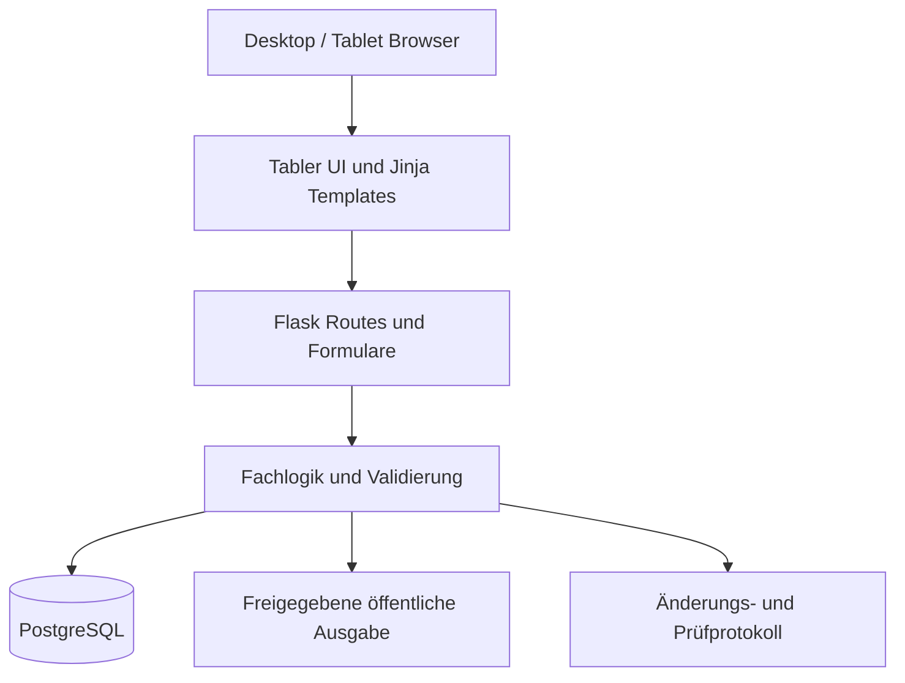
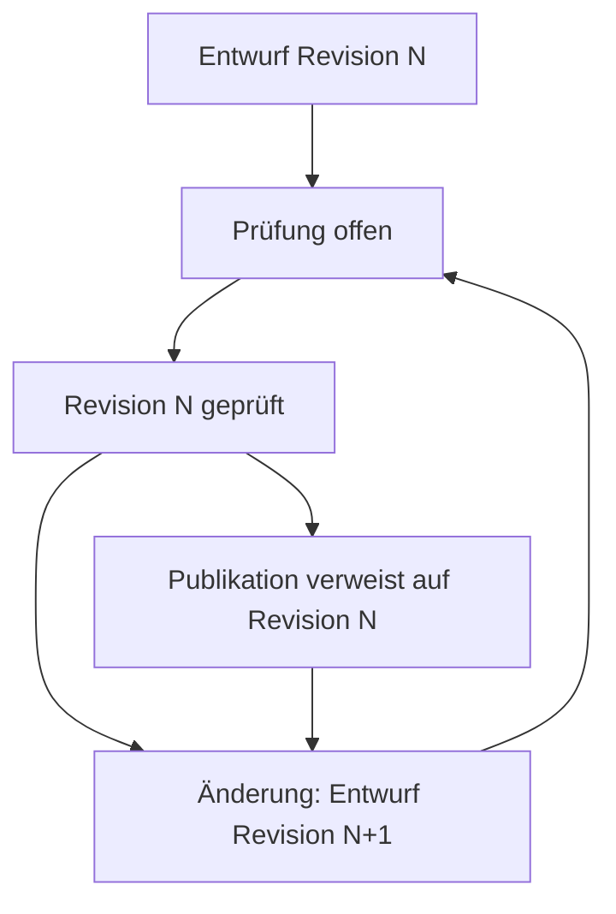

# Dishboard – SDD zur erstmaligen Integration von Tabler

**Projekt:** Dishboard – Menüplanung Klinik Südhang  
**Zweck:** Fachliche und technische Grundlage für die Umgestaltung der Administrationsoberfläche mit Tabler  
**Status:** Soll-Konzept / Tabler noch nicht integriert  
**Bestehende Basis laut Projektkontext:** Flask, Jinja2, PostgreSQL  
**Neu einzuführen:** Tabler UI mit seiner Bootstrap-5-Grundlage  
**Gegenstand dieser Lieferung:** Spezifikation; keine Änderung am laufenden Dishboard  

Die SDD basiert auf den bereitgestellten Screenshots und dem Projektkontext. Das Dishboard-Repository wurde für dieses Dokument nicht untersucht. Dateipfade, neue Modellnamen und zusätzliche Rollen sind Zielvorschläge; vorhandene Implementierungen sind vor Änderungen zuzuordnen. Die Integration von Tabler ist ein ausdrücklich noch auszuführender Entwicklungsauftrag.

---

## 1. Zweck und Zielsetzung

Dishboard verwaltet Menüpläne, Menüs und Komponenten der Klinik Südhang. Die Screenshots zeigen lange Formulare, grosse Leerflächen und uneinheitliche Eingabebereiche. Der funktionale Zustand des Backends ist damit nicht geprüft. Tabler ist nach Angabe des Projektverantwortlichen noch nicht integriert.

Diese SDD beschreibt die erstmalige Einführung von Tabler in die bestehende Administrationsoberfläche. Dafür müssen Assets eingebunden, ein neues Jinja-Basislayout angelegt und die bestehenden Seiten auf Tabler-Markup umgebaut werden. Geschäftslogik, Datenbank und vorhandene URL-Verträge werden dabei weiterverwendet. Fachliche Erweiterungen werden separat als Umsetzungslücken bewertet.

Das Ergebnis soll:

- auf Desktop und Tablet zuverlässig funktionieren
- die Pflege eines Wochenplans beschleunigen
- Prüfstatus und Publikationszustand eindeutig darstellen
- unbekannte Angaben klar von bestätigten Angaben unterscheiden
- Cafeteria-, Mitarbeiter- und Patientenansichten sauber trennen
- bestehende Flask-Formulare und Sicherheitsmechanismen erhalten
- zukünftige Erweiterungen ohne erneuten Komplettumbau ermöglichen

---

## 2. Geltungsbereich

### 2.1 Bestandteil dieser SDD

- Administrationslayout mit Tabler
- Wochenplan für Cafeteria
- Patientenansicht für Mittag und Abend
- Menüeditor
- Komponentenverwaltung
- Allergene, Labels und Herkunft
- Entwurf, Prüfung und Publikation
- Tablet- und Touch-Bedienung
- Flask/Jinja-Integration
- Daten- und Statusanforderungen
- Sicherheits- und Abnahmeanforderungen

### 2.2 Nicht Bestandteil

- Ersatz von Flask durch ein neues Frontend-Framework
- Ersatz von PostgreSQL
- vollständige Neuentwicklung der öffentlichen Ausgabe
- automatische Rezept- oder Nährwertberechnung ohne belastbare Datenquelle
- Veröffentlichung in externen Plattformen
- Bestell- oder Bezahlsystem

---

## 3. Ausgangslage

| Bereich | IST | SOLL nach Umsetzung |
|---|---|---|
| UI-Framework | Tabler noch nicht integriert | Gepinnte Tabler-Version lokal im Admin geladen |
| HTML-Struktur | Bestehende Dishboard-Templates | Jinja-Vererbung mit Tabler-Seitenrahmen |
| Formulare | Lange, teils unstrukturierte Eingabebereiche | Tabler-Karten, Formularfelder und Fehleranzeigen |
| Mobile Nutzung | Gezeigt sind Desktop-Screenshots | Tablet als primäres Bediengerät; Hoch- und Querformat |
| Geschäftslogik | Vorhandener Stand ist im Repository zu prüfen | Bestehende Funktionen erhalten, festgestellte Lücken gezielt schliessen |

Die aktuelle Oberfläche enthält bereits folgende fachliche Bereiche:

- Wochenpläne
- Wochenverwaltung
- Menüs
- Komponenten
- CSV-Import
- Bearbeitung von Preisen, Hinweisen und Serviceinformationen
- Allergenangaben
- Herkunft
- Labels wie vegan und vegetarisch
- Prüf- und Publikationsstatus

Die aktuelle Darstellung verwendet grosse, lange Formulare und wiederholt viele Felder. Auf Tablets müssen Anwender häufig weit scrollen. Der Prüfstatus ist sichtbar, die Beziehung zwischen gespeicherter Version, Prüfung und Publikation muss jedoch technisch eindeutig abgesichert werden.

---

## 4. Nutzerrollen und Berechtigungen

Die folgende Matrix ist ein Vorschlag für die fachliche Abgrenzung. Bestehende Rollen und Gruppen dürfen durch die Tabler-Migration nicht automatisch erweitert oder umbenannt werden.

| Rolle | Lesen | Bearbeiten | Prüfen | Publizieren | Komponenten verwalten |
|---|---:|---:|---:|---:|---:|
| Cafeteria-Administration | Ja | Ja | Ja | Ja | Ja |
| Küchenmitarbeitende | Ja | Ja | Optional | Nein | Optional |
| Redaktion / Support | Ja | Ja | Nein | Nein | Nein |
| Patienten / Öffentlichkeit | Nur freigegebene Ausgabe | Nein | Nein | Nein | Nein |

Die tatsächliche Berechtigungsprüfung erfolgt serverseitig. Das Ausblenden einer Schaltfläche im Browser ersetzt keine Autorisierung.

---

## 5. Fachliche Begriffe

- **Menü:** Ein konkretes Gericht mit Titel, Beschreibung, Komponenten, Preisen, Herkunft, Allergenen und Labels.
- **Komponente:** Einzelne Beilage, Sauce, Zutat oder weiteres Element eines Menüs.
- **Wochenplan:** Zuordnung von Menüs zu Tagen und Menüarten innerhalb einer Kalenderwoche.
- **Entwurf:** Bearbeitbarer Stand, der noch nicht zwingend öffentlich sichtbar ist.
- **Prüfung:** Bestätigung, dass die gespeicherte Version fachlich vollständig und korrekt ist.
- **Publikation:** Übernahme eines geprüften Entwurfs in den öffentlich auszugebenden Stand.
- **Nicht erfasst:** Angabe ist unbekannt oder noch nicht geprüft. Dieser Zustand darf nicht als frei von einem Allergen interpretiert werden.
- **Automatisch geerbt:** Wert wurde aus den hinterlegten Komponenten abgeleitet.
- **Manuell festgelegt:** Wert wurde unabhängig von der automatischen Ableitung gesetzt.

---

## 6. Zielarchitektur

### 6.1 Schichten

1. **Präsentation:** Jinja-Templates, Tabler-CSS, Tabler-JavaScript, eigenes Südhang-CSS.
2. **HTTP-Schicht:** Flask-Routen, Authentifizierung, CSRF, Formularverarbeitung.
3. **Fachlogik:** Statusänderungen, Vererbung, Validierung, Berechtigungen und Publikationsregeln.
4. **Datenzugriff:** PostgreSQL-Modelle und Transaktionen.
5. **Ausgabe:** Öffentliche Cafeteria-, Patienten- und Signage-Ansichten lesen ausschliesslich freigegebene Daten.

Die Templates dürfen keine fachlichen Statusänderungen selbst berechnen. Sie zeigen den vom Server gelieferten Zustand an.

---

## 7. Tabler erstmals integrieren – verbindlicher technischer Entwurf

### 7.1 Integrationsentscheidung

Dishboard soll das Paket `@tabler/core` verwenden. Tabler stellt fertige CSS-/JavaScript-Assets und Bootstrap-basierte Komponenten bereit. Diese können über Flask als lokale statische Dateien ausgeliefert werden. Ein zusätzlicher Frontend-Laufzeitserver ist dafür nicht erforderlich. [Tabler-Projekt](https://github.com/tabler/tabler), [Installation](https://docs.tabler.io/ui/getting-started/installation)

Die Umsetzung besteht aus drei gemeinsam erforderlichen Ergebnissen: lokal eingebundene Tabler-Assets, ein tatsächlich von den Admin-Seiten verwendetes Basislayout und umgebautes Komponenten-Markup. Das alleinige Laden einer CSS-Datei erfüllt den Auftrag noch nicht.

### 7.2 Bestandsaufnahme vor dem Umbau

Für jede Admin-Seite werden Template, Flask-Endpoint, Formularaktion, Feldnamen, CSS-Dateien und JavaScript-Ereignisse dokumentiert. Dabei werden auch verschachtelte Layouts und Makros erfasst. Besonders zu prüfen sind globale Selektoren für `input`, `select`, `label`, `button`, `.row`, `.card` und `.btn` sowie vorhandene Bootstrap- oder jQuery-Abhängigkeiten.

Ergebnis ist eine kurze Zuordnungstabelle im Repository: vorhandene Datei → geplante Änderung → betroffene Funktion → Regressionstest. Öffentliche Templates erhalten einen eigenen Eintrag, damit gemeinsam verwendete Styles erkannt werden.

### 7.3 Paket, Version und Asset-Bereitstellung

| Entscheidung | Umsetzung für Dishboard |
|---|---|
| Paket | `@tabler/core`; vorhandenen Paketmanager weiterverwenden |
| Version | Stabile Version beim Implementierungsstart anhand der Zielbrowser auswählen und exakt pinnen; keine laufende `latest`-Abhängigkeit |
| Reproduzierbarkeit | Paketdefinition und Lockdatei gemeinsam versionieren; gewählte Version im Integrationsnachweis dokumentieren |
| Asset-Schritt | Kompilierte CSS-/JS-Dateien aus dem Paket in das statische Ausgabeverzeichnis übernehmen |
| Laufzeit | Flask liefert fertige Dateien aus; Paketinstallation erfolgt beim Build, nicht beim Seitenaufruf |
| Zusatzdateien | Nur tatsächlich referenzierte Fonts, Bilder oder Plugins übernehmen; relative CSS-URLs erhalten |
| Icons | Benötigte Tabler-Icons als lokale SVG-Dateien; beschriftete Aktionen behalten Text |
| Lizenzen | Lizenzhinweise der ausgelieferten Pakete mitführen |

Falls Dishboard noch keinen Asset-Build besitzt, wird ein kleiner reproduzierbarer Kopierschritt ergänzt. Ein bestehender Build wird erweitert. Tabler-Kerndateien werden unverändert übernommen. Suchbare Auswahlfelder sind eine gesonderte Erweiterung: zunächst native `select`-Felder, optional danach ein bewusst ausgewähltes Select-Plugin mit eigener Versionsbindung.

### 7.4 Vorgeschlagene Dateien und Verantwortlichkeiten

Die Pfade sind relativ zur noch zu bestätigenden Flask-Anwendungsstruktur.

| Zieldatei oder Verzeichnis | Aufgabe |
|---|---|
| `static/vendor/tabler/<version>/css/tabler.min.css` | Versioniertes Tabler-Stylesheet |
| `static/vendor/tabler/<version>/js/tabler.min.js` | Passendes Tabler-JavaScript |
| `static/css/dishboard-admin.css` | Südhang-Gestaltung und tabletbezogene Ergänzungen |
| `static/js/dishboard-admin.js` | Gemeinsame Formular- und Bedienlogik |
| `static/js/dishboard-menu-editor.js` | Dynamische Komponenten und Editorverhalten |
| `templates/admin/base_tabler.html` | Neuer gemeinsamer Admin-Seitenrahmen |
| `templates/admin/partials/sidebar.html` | Navigation und mobile Aufklappfunktion |
| `templates/admin/partials/page_header.html` | Titel, Kontext und Aktionen |
| `templates/admin/macros/forms.html` | Wiederverwendbare Tabler-Formularfelder |
| `templates/admin/macros/status.html` | Einheitliche Status-Badges |
| `templates/admin/weekly_plan.html` | Umgebauter Wochenplan |
| `templates/admin/menu_editor.html` | Umgebauter Menüeditor |
| `templates/admin/components_list.html` | Umgebaute Komponentenverwaltung |
| `templates/admin/component_editor.html` | Umgebauter Komponenteneditor |
| Bestehende öffentliche Basisvorlage | Öffentliche Website und Signage verwenden ihren eigenen Seitenrahmen |

### 7.5 Jinja-Vererbung und Ladereihenfolge

Jede migrierte Admin-Seite erweitert `admin/base_tabler.html`. Die Basisvorlage enthält Dokumentensprache, Viewport-Metatag, Asset-Verweise und die Tabler-Struktur. Seitentemplates liefern nur die Inhalte der vereinbarten Blöcke.

| Jinja-Block | Inhalt |
|---|---|
| `title` | Browser-Titel mit Dishboard und Seitenkontext |
| `page_header` | Titel, Woche, Status und Kontextaktionen |
| `content` | Wochenplan, Liste oder Editor |
| `page_styles` | Nur tatsächlich benötigte seitenspezifische Styles |
| `page_scripts` | Nur tatsächlich benötigte seitenspezifische Skripte |

Die Asset-Reihenfolge ist verbindlich: Tabler-CSS, Dishboard-Admin-CSS, optionale Seitenstyles. Für JavaScript: Tabler, gemeinsame Dishboard-Logik, Seitenlogik; Reihenfolge durch geordnete `defer`-Skripte erhalten. URLs werden mit dem im Projekt verwendeten Flask-Static-Endpoint erzeugt. Die gewählte Asset-Version stammt aus der Anwendungskonfiguration oder einem Build-Manifest.

Im Admin wird kein zweites Bootstrap-Kernbundle zusätzlich geladen. Alte globale Styles werden für migrierte Seiten aus der Vererbung entfernt, sobald benötigte projektspezifische Regeln übertragen sind. Öffentliche Seiten dürfen ihre bisherigen Styles weiterhin laden. [Tabler-Paket und Bootstrap-Grundlage](https://github.com/tabler/tabler)

### 7.6 Tabler-Komponenten konkret zuordnen

Die folgende Tabelle ist die Zielzuordnung für die Screenshots. Die Klassen sind bei Auswahl der Paketversion gegen deren Dokumentation zu prüfen. Die Zusammenstellung und das Bedienverhalten sind Dishboard-Designentscheidungen.

| Vorhandener Bereich | Tabler-/Bootstrap-Baustein | Umsetzung |
|---|---|---|
| Gesamte Admin-Seite | `page`, `page-wrapper`, `page-body` | Einheitlicher Rahmen für alle migrierten Seiten |
| Seitenleiste | `navbar`, `navbar-vertical`, `navbar-expand-xl` | Ab 1200 CSS-Pixeln dauerhaft sichtbar; darunter aufklappbare Navigation |
| Menüeintrag | `nav-item`, `nav-link`, `active` | Aktuelle Seite markieren; lesbarer Titel und optional SVG-Icon |
| Kopfzeile | `page-header`, `page-title` | Woche, Zeitraum und Aktionen zusammenführen |
| Tagesabschnitt | `card`, `card-header`, `card-body` | Betriebsstatus im Kopf, Menüs im Karteninhalt |
| Zwei Menüs pro Tag | `row g-3` und `col-12 col-md-6` | Unter 768 CSS-Pixeln untereinander, darüber nebeneinander |
| Editorlayout | `row g-3`, `col-12 col-xl-8`, `col-12 col-xl-4` | Ab 1200 CSS-Pixeln Hauptformular und Prüfpanel nebeneinander |
| Eingabefelder | `form-label`, `form-control`, `form-select`, `form-text` | Beschriftung direkt beim Feld; verständliche Hilfetexte |
| Modus und Labels | `form-check`, `form-check-input`, `form-check-label` | Radios für Erfassungsmodus, Checkboxen für Labels |
| Fehler | `is-invalid`, `invalid-feedback`, `alert` | Serverfehler am Feld und verlinkte Zusammenfassung |
| Prüfstatus | `badge` mit Text und optional Icon | Status zusätzlich sprachlich ausdrücken |
| Detailbereiche | `accordion`, `accordion-item` | Allergene und Herkunft kompakt anzeigen; Fehlerbereiche automatisch öffnen |
| Aktionen | `btn`, `btn-primary`, `btn-outline-secondary` | Primäraktion Speichern; sekundäre Aktionen visuell zurücknehmen |
| Komponentenliste | `table`, `table-vcenter`, `card-table` | Ab 1200 CSS-Pixeln Tabelle; darunter Karten aus derselben Datenquelle |
| Publikationsbestätigung | `modal` | Zusammenfassung, offene Punkte, Bestätigung und Abbrechen |

Die Grundstruktur folgt den [Tabler-Seitenlayouts](https://docs.tabler.io/ui/layout/page-layouts). Formularfelder orientieren sich an den [Tabler-Formularbausteinen](https://docs.tabler.io/ui/forms/elements), Tagesabschnitte an den [Tabler-Karten](https://docs.tabler.io/ui/components/card).

### 7.7 Gestaltung und Tablet-Masse

Dishboard erhält ein zentrales Admin-Theme. Dunkles Petrol für die Navigation und Bordeaux für die Hauptaktion werden aus den tatsächlichen Südhang-Vorgaben übernommen; aus Screenshots abgeleitete Farben gelten nur als Entwurf. Tabler unterstützt CSS-Variablen und Sass-Anpassungen. Welche Variablen erforderlich sind, wird für die gepinnte Version festgelegt. [Tabler anpassen](https://docs.tabler.io/ui/getting-started/customize)

| Eigenschaft | Zielvorgabe |
|---|---|
| Lauftext und Eingabeschrift | 16 CSS-Pixel als Ausgangswert |
| Touch-Ziele | Hauptaktionen und klickbare Formularzeilen mindestens 48 CSS-Pixel hoch |
| Checkbox/Radio | Gesamte beschriftete Zeile antippbar |
| Abstand zwischen Aktionen | Mindestens 8 CSS-Pixel |
| Karteninnenabstand | 16 CSS-Pixel; auf grossen Bildschirmen 24 möglich |
| Formularbreite | Kurze Felder wie Preise nebeneinander, wenn ausreichend Platz vorhanden ist |
| Fokus | Sichtbar und kontrastreich, auch auf Primärbuttons |
| Kompakte Ansicht | Reduziert Leerraum und Sekundärtexte; Touch-Flächen und Fehlermeldungen bleiben erhalten |

Eigene Strukturregeln verwenden `.dishboard-admin` beziehungsweise `.dishboard-*`. Das Präfix allein schützt nicht vor alten globalen Styles; deren Ladereihenfolge und Entfernung sind Bestandteil der Migration.

### 7.8 Formular- und JavaScript-Vertrag

Tabler gestaltet die Oberfläche. Dishboard bleibt für Speichern, Validierung, Vererbung und Prüfung zuständig. Bestehende `name`-Attribute, versteckte IDs, CSRF-Felder und Aktionsziele werden beim Markup-Umbau erhalten. Allein die Darstellung berechtigt nicht zu einer Schemaänderung.

Dynamische Komponentenzeilen nutzen eindeutige Feld-IDs und dieselbe Namenskonvention wie das Backend. Hinzufügen, Entfernen und Sortieren werden über beschriftete Buttons bedient; Drag-and-drop ist höchstens ergänzend. Gleichartige Ereignisse erhalten einen gemeinsamen Handler, damit neu hinzugefügte Zeilen funktionieren. Framework-Dialoge und Akkordeons werden jeweils nur einmal initialisiert.

Der vollständige Menüeditor bleibt eine eigene Seite. Auf Tablets ist eine lange Menüerfassung in kleinen Dialogen zu vermeiden. Eine Liste darf auf kleine Dialoge für kurze Bestätigungen zurückgreifen. Bei Validierungsfehlern wird das betroffene Akkordeon geöffnet und zum ersten fehlerhaften Feld navigiert.

### 7.9 Nachweis, dass Tabler integriert ist

Die Integration gilt erst als abgeschlossen, wenn alle folgenden Nachweise vorliegen:

1. Ein reproduzierbarer Build liefert die dokumentierte Tabler-Version samt benötigten Assets.
2. Alle vereinbarten Admin-Seiten erben vom neuen Tabler-Basislayout.
3. Die ausgelieferte Seite enthält die vereinbarten Tabler-Klassen; die Darstellung wird nachweislich durch Tabler-Styles bestimmt.
4. Im Browser werden die lokalen Dateien erfolgreich geladen; keine fehlenden Fonts und keine doppelte Bootstrap-Initialisierung.
5. Wochenplan, Menüeditor und Komponentenverwaltung wurden funktional und auf einem echten Tablet geprüft.
6. Aktionsziele, Feldwerte und öffentliche Ausgaben bestehen die Regressionstests.
7. Einbindung, gewählte Version, bearbeitete Dateien und Screenshots der migrierten Seiten sind im Repository dokumentiert.

---

## 8. Seiten- und Navigationskonzept

Die linke Seitenleiste enthält:

1. Logo und Projektbezeichnung Dishboard
2. Benutzer und aktuelle Rolle
3. Wochenpläne
4. Wochenverwaltung
5. Menüs
6. Komponenten
7. CSV-Import
8. Abmelden

Die aktive Seite wird mit einem Tabler-Navigationsstatus hervorgehoben. Unter 1200 CSS-Pixeln wird die Navigation über eine sichtbar beschriftete Schaltfläche «Menü» geöffnet. Geöffnete Einträge zeigen ihre vollständigen Bezeichnungen; die Touch-Bedienung ist nicht von Hover-Tooltips abhängig.

Die Kopfzeile enthält:

- Seitentitel
- ausgewählte Woche oder Kontext
- Gesamtstatus
- offene Prüfungen
- Benutzeraktion

---

## 9. Wochenplan

### 9.1 Cafeteria

Die Cafeteria-Ansicht verwendet fünf Tage von Montag bis Freitag. Jeder Tag enthält zwei Menükarten:

- Menü 1
- Vegetarisch

Der Tageskopf enthält:

- Wochentag und Datum
- Betriebsstatus, zum Beispiel offen oder geschlossen
- Servicehinweis
- Aktion zum Speichern des Servicehinweises

Die Menükarte enthält:

- Menüart
- Titel
- Komponenten beziehungsweise Beilagen
- Allergenstatus
- Labels
- Mitarbeitendenpreis
- externer Preis
- Prüfstatus
- Bearbeiten-Schaltfläche

### 9.2 Patienten

Die Patientenausgabe wird separat modelliert und dargestellt:

- Montag bis Sonntag
- Mittag und Abend
- keine Preise
- keine internen Administrationshinweise
- vereinfachte, gut lesbare Darstellung

Die Patientenansicht darf keine unveröffentlichten Entwürfe anzeigen.

### 9.3 Kopfaktionen

- Woche auswählen
- Vorwoche kopieren
- Vorschau öffnen
- Wochenangaben speichern
- offene Prüfungen anzeigen
- publizieren

Die Publikationsaktion zeigt vor dem Absenden eine Zusammenfassung der betroffenen Tage und Menüs.

---

## 10. Menüeditor

Der Menüeditor ist ein strukturiertes Formular mit klar getrennten Karten.

### 10.1 Formularbereiche

1. **Grunddaten:** Titel, Beschreibung, Hinweis.
2. **Preise:** Mitarbeitende und externe Gäste.
3. **Komponenten:** Auswahl und Reihenfolge.
4. **Allergene:** automatisch oder manuell.
5. **Herkunft:** automatisch oder manuell.
6. **Labels:** glutenfrei, laktosefrei, vegan, vegetarisch.
7. **Prüfung:** offene Punkte, letzte geprüfte Version und Bestätigung.

Ab 1200 CSS-Pixeln stehen Grunddaten und Prüfpanel nebeneinander. Darunter werden die Karten untereinander dargestellt. Die Breite entscheidet, nicht die Gerätebezeichnung; dies berücksichtigt auch grosse Tablets im Querformat.

### 10.2 Aktionen

Die primären Aktionen sind dauerhaft erreichbar:

- Speichern
- Abbrechen
- Speichern und zurück zum Wochenplan
- Prüfung öffnen

Beim Verlassen eines Formulars mit ungespeicherten Änderungen wird eine verständliche Warnung angezeigt.

### 10.3 Validierung

Pflichtfelder und fachliche Fehler erscheinen am betroffenen Feld. Eine Zusammenfassung am Formularanfang verweist zusätzlich auf die Fehler.

Bestehende Formularnamen, CSRF-Schutz, Fehlermeldungen und Rücksprünge zur ausgewählten Kalenderwoche bleiben erhalten.

---

## 11. Komponentenverwaltung

Die Komponentenliste wird ab 1200 CSS-Pixeln als Tabler-Tabelle dargestellt. Darunter wird jede Komponente als Karte mit Name, Kategorie, Verwendung und Bearbeiten angezeigt. Zusätzliche Angaben sind aufklappbar. Tabelle und Karten verwenden dieselbe serverseitige Datenquelle und dieselben Filter.

### 11.1 Spalten

- Name
- Kategorie
- Herkunft
- Labels
- Verwendung in Menüs
- Aktiv / archiviert
- Bearbeiten

### 11.2 Filter

- Freitextsuche
- Kategorie
- nur Cafeteria
- archivierte Komponenten anzeigen
- nur verwendete Komponenten

### 11.3 Komponenteneditor

Der Editor enthält:

- Name
- Kategorie
- Herkunft
- Labels
- Allergene
- Archivstatus
- Verwendungsübersicht

Vor dem Archivieren wird angezeigt, in welchen Menüs die Komponente verwendet wird. Das Archivieren darf bestehende veröffentlichte Pläne nicht nachträglich verändern.

---

## 12. Allergene, Herkunft und Labels

### 12.1 Erfassungsmodi

Für Allergene, Herkunft und Labels wird jeweils zwischen zwei Modi unterschieden:

- automatisch aus Komponenten geerbt
- manuell festgelegt

Der aktive Modus wird im Editor eindeutig angezeigt.

### 12.2 Allergenstatus

Als fachliches Ziel sind folgende Zustände vorgesehen; die bestehenden Werte und ihre Bedeutung müssen im Repository bestätigt werden, bevor sie erweitert oder umbenannt werden:

- enthält
- kann enthalten
- nicht enthalten
- nicht erfasst

Leere Felder gelten als **nicht erfasst**. Sie erzeugen kein „frei von“-Label.

### 12.3 Herkunft

Die Herkunft wird über eine Länderauswahl mit sichtbarem Ländernamen gepflegt. Intern wird der ISO-Code gespeichert. Freitext-Eingaben für ISO-Codes werden vermieden.

### 12.4 Labels

Automatische Labels werden nur gesetzt, wenn alle relevanten Komponenten eindeutig bewertet sind. Manuelle Labels werden mit ihrer Quelle gespeichert und im Prüfpanel angezeigt.

---

## 13. Status- und Revisionsmodell

### 13.1 Statusmaschine

Die Publikation behält ihren Verweis auf Revision N, während Revision N+1 bearbeitet wird. Die Rückkehr zur Prüfung betrifft den neuen Entwurf und entzieht der bisherigen Ausgabe nicht ihren publizierten Stand. Diese Fachlogik ist im Backend zu prüfen; sie wird nicht durch Tabler bereitgestellt.

### 13.2 Regeln

- Jede relevante Änderung erzeugt eine neue Revision oder erhöht die Revision der betroffenen Einheit.
- Eine Prüfung ist immer an eine konkrete Revision gebunden.
- Nach einer Änderung wird der Entwurf wieder prüfpflichtig.
- Der zuletzt publizierte Stand bleibt unverändert, bis eine neue Version publiziert wird.
- Eine Prüfung einer älteren Revision darf keine Publikation erlauben.
- Der Server prüft den Status nochmals unmittelbar vor der Publikation.

### 13.3 Öffentliche Ausgabe

Öffentliche Ansichten lesen nur den freigegebenen Stand. Ungeprüfte Entwürfe dürfen nicht durch direkte URL-Parameter sichtbar werden.

---

## 14. Datenmodell – fachliche Mindeststruktur

Die folgende Struktur ist ein fachlicher Zielvorschlag, keine Beschreibung der bestehenden Datenbank. Für die reine Tabler-Einbindung ist keine neue Tabelle erforderlich. Falls bei der Bestandsaufnahme Lücken in Revisionen oder Publikation nachgewiesen werden, werden diese in einem getrennten Backend-Arbeitspaket geschlossen. Vorhandene gleichwertige Modelle werden weiterverwendet.

### 14.1 Entitäten

| Entität | Zweck |
|---|---|
| `menu` | Grunddaten eines Menüs |
| `menu_revision` | gespeicherte Version eines Menüs |
| `component` | wiederverwendbare Komponente |
| `menu_component` | Zuordnung Menü zu Komponente und Reihenfolge |
| `allergen_value` | Allergenstatus je Menü oder Komponente |
| `origin_value` | Herkunft und Erfassungsmodus |
| `menu_label` | Labels und Erfassungsmodus |
| `weekly_plan` | Kalenderwoche und Zielbereich |
| `weekly_plan_entry` | Zuordnung Tag, Mahlzeit und Menü |
| `publication` | freigegebener Stand |
| `review` | Prüfung einer konkreten Revision |
| `audit_event` | protokollierte Änderung oder Statusaktion |

### 14.2 Integritätsregeln

- Fremdschlüssel verhindern verwaiste Zuordnungen.
- Reihenfolge von Komponenten ist deterministisch.
- Publikation referenziert eine konkrete geprüfte Revision.
- Gelöschte oder archivierte Komponenten bleiben in alten Revisionen nachvollziehbar.
- Preise werden als numerische Werte mit zwei Dezimalstellen gespeichert.

---

## 15. Flask-Routen

Tabler wird hinter den vorhandenen Flask-Routen eingeführt. Eine Umbenennung ist für das UI-Framework nicht erforderlich. Die frühere Fassung enthielt beispielhafte neue Routen; die folgende Tabelle trennt belegte URLs und noch zu prüfende Verträge.

| Route oder Vertrag | Kenntnisstand und Umsetzung |
|---|---|
| `/admin/cafeteria/menu?week=…&day=…&meal=LUNCH&option=MENU_1` | Im Screenshot als Menüeditor erkennbar; Parameter beim Speichern und Rücksprung erhalten |
| `/admin/cafeteria/komponenten` | Im Screenshot als Komponentenliste erkennbar; neue Tabler-Liste hier rendern |
| `/admin/cafeteria/komponenten/<id>` | Im Screenshot als Komponenteneditor erkennbar; neues Editor-Markup hier rendern |
| Wochenplan-Endpoint | Im Repository ermitteln; nicht aus der Editor-URL ableiten |
| Speichern, Kopieren, Prüfen und Publizieren | Bestehende POST-Aktionen und Flask-Endpoint-Namen aufnehmen und weiterverwenden |
| Öffentliche Website-, Patienten- und Signage-Routen | Tatsächliche Pfade und Ausgabeformate im Repository prüfen; eigene Layouts erhalten |

Alle schreibenden Aktionen verwenden POST und CSRF-Schutz. GET-Anfragen verändern keine Daten.

---

## 16. Tablet- und Touch-Anforderungen

Die primäre Zielgrösse ist ein Tablet im Quer- oder Hochformat. Die Ansicht muss auch auf kleineren mobilen Breiten stabil bleiben.

### 16.1 Layoutregeln

- Desktop: zweispaltige Karten, wenn ausreichend Platz vorhanden ist.
- Tablet: eine Hauptspalte, optionale zweite Spalte nur bei ausreichender Breite.
- Smartphone: Kartenansicht und reduzierte Tabellen.
- Keine horizontale Gesamtseiten-Scrollbewegung bei 360 Pixel Breite.
- Lange Textfelder erhalten sinnvolle Mindesthöhen.
- Dropdowns und Kontrollfelder sind touchfreundlich.

### 16.2 Aktionsleiste

Die Speichern-Leiste wird als eigener Dishboard-Baustein mit Tabler-Buttons umgesetzt. Sie bleibt bevorzugt sticky am unteren Rand. Für geöffnete Bildschirmtastaturen wird ihr tatsächliches Verhalten auf dem Zielgerät geprüft; bei Überdeckung wechselt sie in den normalen Dokumentfluss. Sie muss:

- den Inhalt nicht verdecken
- bei geöffneter Bildschirmtastatur erreichbar bleiben
- eine sichtbare Fokusmarkierung besitzen
- auf kleinen Bildschirmen umbrechen dürfen

### 16.3 Tablet-Abnahme

Die wichtigsten Abläufe werden auf dem tatsächlich eingesetzten Tabletmodell mit dokumentierter Browser-/Betriebssystemversion im Hoch- und Querformat geprüft. Vor Auswahl der Tabler-Version wird deren Browser-Unterstützung mit diesen Geräten abgeglichen.

| Prüfbreite in CSS-Pixeln | Erwartetes Layout |
|---|---|
| 360 | Navigation aufklappbar; Menüs, Formular und Komponentenkarten einspaltig |
| 768 und 820 | Navigation aufklappbar; zwei Menüs pro Tag; Editor einspaltig |
| 1024 | Gleiches Verhalten; ausreichend Platz für umgebrochene Aktionsleisten |
| 1199 / 1200 | Gezielter Test des Umschaltpunkts für Navigation, Editor und Komponentenliste |
| 1280 | Dauerhafte Seitenleiste und zweispaltiger Editor |

Zusätzlich werden Bildschirmtastatur, lange Menütexte, eine grosse Komponentenliste, sichtbare Fehler und Geräte-Rotation getestet. Vertikales Scrollen ist zulässig; horizontales Scrollen der gesamten Seite nicht. Browser-Zoom bleibt erlaubt.

---

## 17. Sicherheit

- Authentifizierung bleibt an die bestehende Anwendung angebunden.
- Berechtigungen werden serverseitig geprüft.
- Alle schreibenden Formulare verwenden CSRF-Schutz.
- Eingaben werden serverseitig validiert und HTML-escaped ausgegeben.
- Publikation erfordert eine aktuelle Berechtigung und eine aktuelle geprüfte Revision.
- Öffentliche Routen dürfen keine Entwurfsdaten offenlegen.
- Audit-Ereignisse enthalten Benutzer, Zeitpunkt, Objekt, Aktion und Revision.
- CSV-Importe werden validiert; Formeln und unerwartete Steuerzeichen werden entschärft.

---

## 18. Fehler- und Sonderfälle

| Fall | Verhalten |
|---|---|
| Pflichtfeld fehlt | Speichern wird abgelehnt; Fehler bleibt am Feld sichtbar |
| Allergenangaben fehlen | Status „nicht erfasst“; keine Frei-von-Aussage |
| Komponente wurde geändert | betroffene Menürevision wird prüfpflichtig |
| Prüfung ist veraltet | Publikation wird serverseitig abgelehnt |
| Woche ist bereits publiziert | Änderungen erzeugen neuen Entwurf |
| Komponente archiviert | alte Revisionen bleiben lesbar |
| Session läuft ab | Formular wird nicht still verworfen; Benutzer erhält verständlichen Hinweis |
| Tablet verliert Verbindung | keine Erfolgsmeldung ohne bestätigte Serverantwort |
| Doppelklick auf Speichern | Aktion wird idempotent behandelt oder kurz deaktiviert |

---

## 19. Migration und Rollout

### 19.1 Kleine Arbeitspakete mit prüfbaren Ergebnissen

Alle Pakete stehen zu Beginn auf **offen**. Diese SDD ist kein Nachweis ihrer Umsetzung.

| WP | Auftrag | Ergebnis / Abnahme | Abhängigkeit |
|---|---|---|---|
| T01 | Bestehende Templates, Assets und Formularverträge erfassen | Belegte Zuordnungstabelle, Zielgeräte und Vergleichsscreenshots | Keine |
| T02 | Tabler-Paket auswählen und pinnen | Paket-/Lockdatei, Lizenzhinweise und dokumentierte Version | T01 |
| T03 | Asset-Schritt in Build und Auslieferung integrieren | CSS und JS lokal mit HTTP 200 geladen; reproduzierbarer Build | T02 |
| T04 | `base_tabler.html` und mobile Navigation erstellen | Authentifizierte Entwicklungsseite zeigt echte Tabler-Navigation und Karten | T03 |
| T05 | Südhang-Theme und Formular-/Statusmakros erstellen | Referenzseite mit Feldfehlern, Touch-Zielen und allen Statusanzeigen | T04 |
| T06 | Wochenplan auf Tabler umbauen | Alle zehn Cafeteria-Menükarten; Woche, Service und Aktionen funktionieren | T05 |
| T07 | Grunddaten und Preise im Menüeditor migrieren | Bestehende POST-Felder, Fehler und Rücksprung unverändert nutzbar | T05 |
| T08 | Komponenten, Allergene, Herkunft und Labels migrieren | Dynamische Zeilen, Vererbungsanzeige und Fehler in Akkordeons funktionieren | T07 |
| T09 | Komponentenliste und Editor migrieren | Tabelle/Karten, Filter, Verwendung und Archivierung geprüft | T05 |
| T10 | Restliche Admin-Seiten migrieren | Menüs, Wochenverwaltung und CSV-Import nutzen dasselbe Layout | T06–T09 |
| T11 | Tablet- und Regressionstests durchführen | Nachweise gemäss Kapitel 20, einschliesslich echter Bildschirmtastatur | T06–T10 |
| T12 | Admin-Umschaltung und Rückweg erproben | Freigabeentscheidung und getesteter Wechsel zur bisherigen Oberfläche | T11 |

Pro Arbeitspaket werden geänderte Dateien, relevante Prüfschritte und bekannte Restpunkte dokumentiert. T04 ist nur auf einer geschützten Entwicklungs-/Testumgebung vorgesehen und wird nicht als öffentlicher Demo-Endpoint ausgeliefert.

### 19.2 Fachliche Lücken separat behandeln

Ergibt T01 eine Lücke bei Prüfungen, Revisionen oder Publikation, wird dafür ein eigenes Backend-Paket angelegt. Dieses benennt die vorhandenen Modelle, erforderliche Migration, Datenübernahme und Fachtests. Tabler-Arbeiten dürfen nicht stillschweigend Rollen, Allergenbedeutungen oder Publikationsregeln ändern. Fachliche Blocker müssen vor Produktionsfreigabe geschlossen sein.

### 19.3 Umschaltung und Rückweg

Während der Migration kann eine serverseitige Konfiguration `ADMIN_UI_THEME` zwischen `legacy` und `tabler` wählen. Beide Ansichten verwenden dieselben fachlichen Services und Formularverträge. Eine Manipulation von URL-Parametern darf keine Berechtigung umgehen.

Nach erfolgreicher Abnahme wird die Konfiguration für die Administration auf Tabler umgestellt. Für den Rückweg bleiben das vorherige Release und dessen vollständige Assets verfügbar. Backend-/Datenmigrationen benötigen einen eigenen kompatiblen Rückweg; ein UI-Schalter macht sie nicht rückgängig.

Öffentliche Website- und Digital-Signage-Layouts werden in dieser Tabler-Admin-Migration nicht umgestellt. Ihre Ausgabe wird auf unveränderte Funktion geprüft. Eine spätere Designänderung erhält einen eigenen Auftrag.

---

## 20. Test- und Abnahmekriterien

### 20.1 Funktional

- Woche kann ausgewählt und angezeigt werden.
- Vorwoche kann kopiert werden.
- Menü kann gespeichert und bearbeitet werden.
- Komponenten können hinzugefügt, entfernt und sortiert werden.
- Herkunft, Allergene und Labels können automatisch oder manuell gepflegt werden.
- Servicehinweise können pro Tag gespeichert werden.
- Prüfung kann nur für den gespeicherten Stand bestätigt werden.
- Publikation schlägt bei offenen oder veralteten Prüfungen fehl.
- Patientenansicht zeigt keine Preise.

### 20.2 Status

- Eine Änderung setzt den Entwurf auf „Prüfung offen“.
- Der publizierte Stand bleibt unverändert.
- Eine alte Prüfung kann nicht für eine neue Revision verwendet werden.
- Komponentenänderungen markieren abhängige Menüs.

### 20.3 Responsive Bedienung

- Tablet im Hoch- und Querformat funktioniert.
- Kein horizontales Scrollen der gesamten Seite bei 360 Pixeln.
- Buttons und Auswahlfelder sind touchfreundlich.
- Speichern bleibt bei langen Formularen erreichbar.
- Bildschirmtastatur verdeckt weder Eingabefeld noch Fehlermeldung.
- Fokus ist bei Tastaturbedienung sichtbar.

### 20.4 Regression

- Bestehende direkten Editor-Links funktionieren.
- Formularnamen und POST-Aktionen bleiben kompatibel.
- CSRF-Schutz bleibt aktiv.
- Öffentliche Ausgabe zeigt weiterhin korrekte freigegebene Daten.
- CSV-Import und bestehende Berechtigungen funktionieren weiterhin.

### 20.5 Tabler-spezifische Integrationstests

| ID | Test | Erwartetes Ergebnis |
|---|---|---|
| TAB-01 | Sauberer Build mit Lockdatei | Dokumentierte Tabler-Version wird reproduzierbar bereitgestellt |
| TAB-02 | Netzwerkprüfung einer Admin-Seite | Lokales Tabler-CSS/JS, alle benötigten Dateien geladen, keine CDN-Abhängigkeit |
| TAB-03 | Basislayout aller migrierten Seiten prüfen | Tatsächliche Jinja-Vererbung und Komponenten aus Kapitel 7 vorhanden |
| TAB-04 | Mobile Navigation mehrfach öffnen/schliessen | Einmalige Reaktion; Fokus und Beschriftung nachvollziehbar |
| TAB-05 | Formularfehler in geschlossenem Allergenbereich auslösen | Bereich öffnet; Fehler und Eingabewert sichtbar |
| TAB-06 | Dynamische Komponentenzeilen hinzufügen und entfernen | Eindeutige IDs und korrektes Backend-Payload |
| TAB-07 | Bestehende CSS-/JS-Dateien prüfen | Kein zweites Bootstrap-Bundle; keine unbeabsichtigten Altstil-Überschreibungen |
| TAB-08 | Tablet drehen und Tastatur öffnen | Nutzbare Formulare und Aktionsleiste ohne verdeckte Eingaben |
| TAB-09 | UI-Konfiguration zurückstellen | Bisherige Oberfläche funktioniert mit kompatiblen Daten weiter |

Tabler ist erst nach bestandenen Integrations-, Funktions- und Tablet-Prüfungen als **integriert** zu dokumentieren.

---

## 21. Offene Entscheidungen

Vor der Implementierung müssen folgende Punkte geklärt oder aus dem bestehenden Projekt bestätigt werden:

1. Werden Revisionen bereits in der Datenbank geführt oder müssen sie ergänzt werden?
2. Gibt es getrennte Datensätze für Cafeteria und Patienten oder nur unterschiedliche Ausgabefilter?
3. Welche Rollen dürfen eine Prüfung bestätigen?
4. Soll die Publikation die komplette Woche oder einzelne Tages-/Menürevisionen freigeben?
5. Welche Signage-Auflösungen müssen zusätzlich getestet werden?
6. Welche Allergen-Systematik ist verbindlich und welche Bezeichnungen werden öffentlich angezeigt?
7. Welche bestehende CSS-Datei darf entfernt oder ersetzt werden?
8. Welcher Paketmanager und welcher Asset-Build existieren bereits?
9. Welche realen Tabletmodelle und Browser bestimmen die Auswahl der Tabler-Version?
10. Welche Endpoint-Namen und gemeinsamen Templates müssen bei T01 übernommen werden?

---

## 22. Erfolgskriterium

Die Umstellung ist erfolgreich, wenn die Administration nachweislich Tabler-Assets und Tabler-Komponenten verwendet und die Küchenadministration eine komplette Woche auf dem Zieltablet bearbeiten, prüfen und veröffentlichen kann. Horizontales Scrollen der Gesamtseite, unklare Allergeninterpretationen und die Veröffentlichung ungeprüfter Entwürfe verhindern die Abnahme. Bis zur tatsächlichen Umsetzung und Prüfung lautet der Integrationsstatus weiterhin **offen**.
 tabler sdd hier, mit fable arbeit gegengleichen und weiter damit
