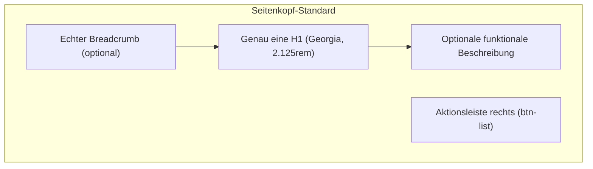
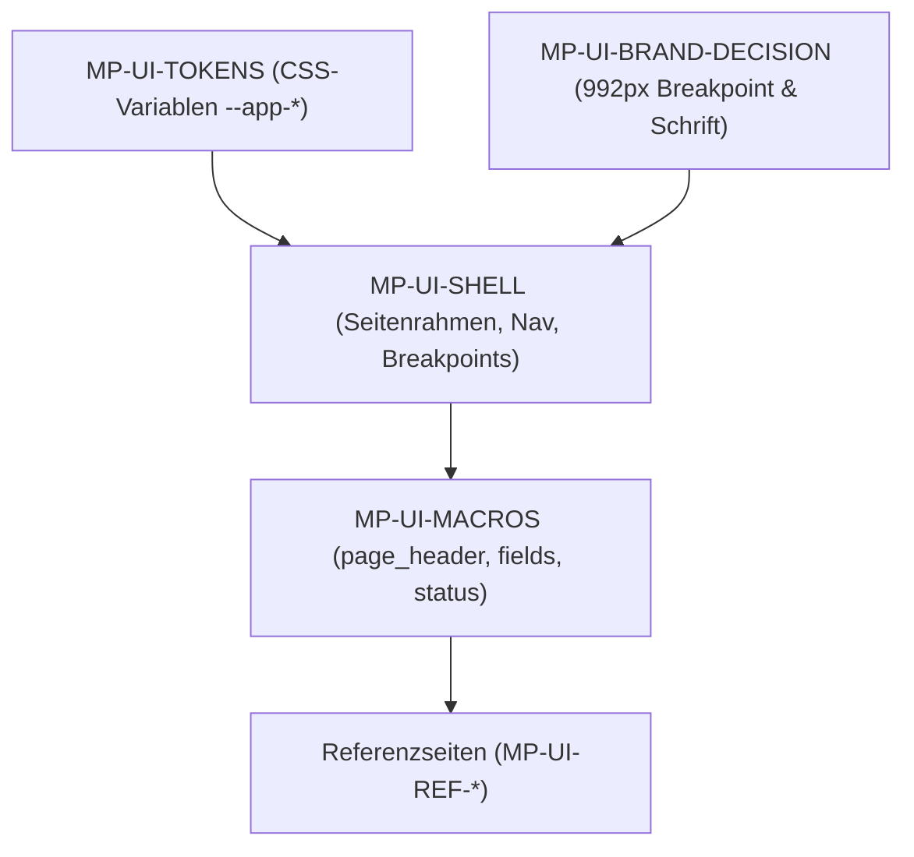

# Spezifikation: Admin-Seitenrahmen und aufgabenbezogene Navigation

**Dokument-ID:** `2026-09-11-admin-shell-navigation-spec`  
**Status:** Entwurf / Spezifikation (Input für Arbeitspaket `MP-UI-SHELL`)  
**Datum:** 11. September 2026  
**Autor:** Antigravity (agy-lane), im Auftrag des Orchestrators Claude Code  
**Integrationsbasis:** `2db9c56563012609c5753047e4ff1ce08b85d9d3` (`integrate/ui-inventory-0911`)  
**Verbindliche Wertetabelle:** `docs/design/2026-09-09-unified-ui-design-system.md` (Masterprompt)  
**Quellen und Verträge:** `docs/superpowers/backlog-0909/surfaces-sdd.md`, `docs/superpowers/backlog-0909/surfaces-wps.json`, `docs/superpowers/backlog-0909/ui-route-matrix.json`, `.claude/evidence/ui-inventory-proof-fix-0909/design-reference-0911.md`

---

## 1. Zweck und Geltung

Dieses Dokument definiert die verbindliche Architektur und visuelle Spezifikation für den Administrations-Seitenrahmen (Admin-Shell), die aufgabenbezogene Hauptnavigation, das responsive Verhalten, den Seitenkopf-Vertrag sowie die Zuordnung der Layoutvarianten für die Menüplanungs-Anwendung Südhang Dishboard.

Es dient als fachliche und gestalterische Vorarbeit für das nachfolgende Implementierungs-Arbeitspaket **`MP-UI-SHELL`** (Master §§7, 10; Surfaces-SDD Abschnitte 4 und 5; `surfaces-wps.json`).

### 1.1 Geltungsbereich und Abgrenzung
- **Geltungsbereich:** Sämtliche internen Administrationsseiten, die das Admin-Layout nutzen (in `ui-route-matrix.json` als `layout_variant: "admin_tabler"` klassifiziert).
- **Keine Freigabeerteilung:** Nach Master §11 Phase C und §12 ist dieses Dokument eine Spezifikation und stilistische Vorbereitung; ein Agentenurteil stellt keine formelle Auftraggeberfreigabe dar. Die Abnahme erfolgt ausschliesslich durch den Auftraggeber.
- **Keine Produktänderung:** Dieses Dokument ändert keine Templates, kein CSS, kein Python-Backend, keine Datenbank und keine bestehenden API-Verträge. Produktcode wurde ausschliesslich lesend analysiert.
- **Master als einzige Wertetabelle:** Alle Masse, Abstände, Typografiewerte und Tokennamen entstammen dem Masterprompt (`docs/design/2026-09-09-unified-ui-design-system.md`). Es werden keine eigenen Parallelwerte oder Hex-Farbwerte erfunden.
- **Abgrenzung zu Nicht-Admin-Layouts:** Spezialisierte Layouts wie `auth` (Login ohne Sidebar), `public` (öffentliche Speisepläne), `signage` (Digital-Signage-Vollbildschirme), `print` (Druckausgaben ohne Navigationsleisten) sowie `api_docs` (externe API-Dokumentation) unterliegen eigenständigen Arbeitspaketen (`MP-UI-OUTPUT-HUBS`, `MP-UI-PUBLIC-VIEWS`) und werden durch diese Admin-Shell nicht überschrieben.

---

## 2. Ist-Befund mit Datei- und Zeilenbelegen

Die Analyse der bestehenden Codebasis und der Vorher-Screenshots (`.claude/evidence/ui-inventory-proof-fix-0909/capture-promoted-0911/screenshots/`) zeigt folgende strukturelle und visuelle Defizite:

### 2.1 Sidebar-Struktur
1. **Zwei getrennte Sidebar-Pfade:**  
   In `reference_scaffold/cafeteria/templates/admin/_workflow_sidebar.html` existieren zwei getrennte Implementierungen:
   - Zeilen 4–32: Ein altes, reduziertes Fallback für `not tabler_admin` (`<aside class="admin-sidebar">`).
   - Zeilen 34–126: Die eigentliche Tabler-Sidebar mit `<aside class="navbar navbar-vertical navbar-expand-xl admin-sidebar" data-bs-theme="dark">`.
2. **Flache, ungegliederte Navigation:**  
   In `_workflow_sidebar.html` (Zeilen 61–78) wird die Navigationsliste `nav_items` als unstrukturierte Aneinanderreihung von Tupeln definiert. Beim Rendern (Zeilen 79–109) wird eine flache `<ul class="navbar-nav">` erzeugt. Sämtliche 14 Menüpunkte (in Admin-Sicht) stehen gleichrangig untereinander. Alltägliche Planungsaufgaben («Wochenpläne»), Stammdaten («Grundlagen», «Komponenten»), Einmalimporte («CSV Import») und administrative Systemeinstellungen («Benutzer & Zugriff», «Design & Marke») besitzen keinerlei visuelle oder thematische Gruppierung.
3. **Plazierung von Benutzerinformation und Abmelden:**  
   - Der Benutzerblock `.admin-user` (Zeilen 53–60) liegt am oberen Rand der Sidebar direkt unter dem Logo-Container `.admin-brand` (Zeilen 39–42). Er nimmt wertvollen vertikalen Raum im primären Blickfeld ein.
   - Das Abmeldeformular (Zeilen 110–122) liegt am Ende der Navigation im `.navbar-footer`.
4. **Einzeilige, knappe Beschriftung:**  
   Bestehende Einträge bestehen ausschliesslich aus einem Icon und einem kurzen Textlabel (z. B. «Menüs», «Komponenten», «Grundlagen»). Neue Benutzer erhalten keinen Hinweis auf den funktionalen Unterschied benachbarter Einträge.

### 2.2 Bedingungen und Rollenabhängigkeiten
Die Sichtbarkeit von Menüeinträgen wird in `_workflow_sidebar.html` und serverseitig in den Routen über drei Prädikate gesteuert (belegt in `docs/superpowers/backlog-0909/ui-route-matrix.json` unter `common.navigation.conditionals`):
- **`can_browse_recipes`** (`_workflow_sidebar.html` Zeilen 73–77):  
  Prädikat: `capabilities() & {'*', 'draft.read'}`.  
  Sichtbar für die Rollen: `Cafeteria.Editor`, `Cafeteria.Publisher`, `Cafeteria.Admin`.  
  Schaltet die Menüpunkte **«Rezepte»** (`admin.recipes_list`) und **«Kochbücher»** (`admin.cookbooks_list`) frei.
- **`can_manage_users`** (`_workflow_sidebar.html` Zeilen 89–95):  
  Prädikat: `'*' in allowed or 'users.manage' in allowed`.  
  Sichtbar ausschliesslich für: `Cafeteria.Admin`.  
  Schaltet den Menüpunkt **«Benutzer & Zugriff»** (`admin.local_users_list`) frei.
- **`can_configure_display`** (`_workflow_sidebar.html` Zeilen 96–108):  
  Prädikat: `'*' in capabilities()`.  
  Sichtbar ausschliesslich für: `Cafeteria.Admin`.  
  Schaltet die Menüpunkte **«Design & Marke»** (`admin.branding_editor`) und **«Bereiche & Zeiten»** (`admin.operations_settings`) frei.
- **Immer sichtbare Menüpunkte (für authentifizierte Admin-Benutzer):**  
  «Wochenpläne», «Wochenverwaltung», «Menüs», «Komponenten», «Grundlagen», «CSV Import», «Screens», «Vorlagen», «API & Schnittstellen» sowie «Abmelden».
- **Noscript-Redundanz:**  
  In `_workflow_sidebar.html` Zeilen 43–51 existiert ein separater `<noscript><nav class="admin-nav d-xl-none">`-Block für Rezepte und Kochbücher, der bei JavaScript-loser Nutzung spezifische Links doppelt rendert.

### 2.3 Heutige Icons und visuelle Doppelbelegungen
Die Prüfung von `_workflow_sidebar.html` (Zeilen 63–106) deckt gravierende Doppelbelegungen von Tabler-Icons auf:

| Navigationseintrag | Heutiges Icon (`icon(name)`) | Konflikt / Doppelbelegung |
|---|---|---|
| Wochenpläne | `calendar-week` | Eigenständig |
| Wochenverwaltung | `calendar-cog` | **Identisch** mit «Bereiche & Zeiten» (`calendar-cog`) |
| Menüs | `tools-kitchen-2` | **Identisch** mit «Rezepte» (`tools-kitchen-2`) |
| Komponenten | `components` | **Identisch** mit «Grundlagen» (`components`) |
| Grundlagen | `components` | **Identisch** mit «Komponenten» (`components`) |
| Rezepte | `tools-kitchen-2` | **Identisch** mit «Menüs» (`tools-kitchen-2`) |
| Kochbücher | `copy` | **Identisch** mit «Vorlagen» (`copy`) |
| CSV Import | `file-import` | Eigenständig |
| Screens | `eye` | **Identisch** mit «Design & Marke» (`eye`) |
| Vorlagen | `copy` | **Identisch** mit «Kochbücher» (`copy`) |
| API & Schnittstellen | `info-circle` | **Identisch** mit «Benutzer & Zugriff» (`info-circle`) |
| Benutzer & Zugriff | `info-circle` | **Identisch** mit «API & Schnittstellen» (`info-circle`) |
| Design & Marke | `eye` | **Identisch** mit «Screens» (`eye`) |
| Bereiche & Zeiten | `calendar-cog` | **Identisch** mit «Wochenverwaltung» (`calendar-cog`) |
| Abmelden | `logout` | Eigenständig |

*Befund:* 12 von 14 Navigationseinträgen teilen sich paarweise dasselbe Icon. Dies führt zu Verwirrung und schwächt die visuelle Orientierung massiv.

### 2.4 Breakpoint und mobiles Verhalten
1. **Verfrühter Breakpoint-Kollaps:**  
   In `_workflow_sidebar.html` Zeile 34 ist die Sidebar mit der Klasse `navbar-expand-xl` konfiguriert. In `reference_scaffold/cafeteria/static/admin-tabler.css` (Zeilen 61–72) greifen Media-Queries auf `min-width: 1200px` bzw. `max-width: 1199.98px`.  
   *Auswirkung:* Auf Bildschirmen mit einer Breite von 1024 px (typischer kleiner Desktop, Tablet im Querformat oder iPad Pro; belegt im Referenzscreenshot `admin_design_darstellung-reference-1024x768.png`) kollabiert die Sidebar vollständig in einen mobilen Header mit Burger-Menü («Menü»). Obwohl horizontal reichlich Platz vorhanden wäre, wird der Nutzer gezwungen, das Menü jedes Mal über ein Dropdown zu öffnen.  
   *Master-Vorgabe (Master §10):* Die Desktop-Sidebar muss ab `992px` (Tabler-Standard `lg`) permanent stehen.
2. **Fehlende Tastatur- und Fokusdisziplin:**  
   Im aktuellen CSS (`admin-tabler.css`) und Template existieren keine standardisierten Mechanismen für Escape-Schliessen des Collapse-Menüs, keinen automatischen Fokus-Rücksprung auf den auslösenden Menübutton und keine Trap-Focus-Steuerung.

### 2.5 Heutiger Seitenkopf (Page Header)
1. **Struktur im Basis-Template:**  
   `reference_scaffold/cafeteria/templates/admin/base_tabler.html` (Zeilen 23–28) umschliesst den Seitenkopf mit `<header></header>`. Direkt darunter folgt `<div class="page-body"><div class="container-xl">...</div></div>`.
2. **Makro-Implementierung:**  
   `reference_scaffold/cafeteria/templates/admin/_macros.html` (Zeilen 31–47) stellt das Makro `page_header(title, pretitle=none)` bereit:
   - Es rendert optional einen Eyebrow-Text (`<div class="page-pretitle">{{ pretitle }}</div>`) und die Hauptüberschrift (`<h1 class="page-title">{{ title }}</h1>`).
   - Es erzwingt ein festes `.container-xl` (1200 px in Standard-Bootstrap), unabhängig davon, ob die Seite als breite Arbeitsfläche oder schmal konzipiert ist.
   - Es besitzt **keinen** Parameter für eine Seitenbeschreibung.
3. **Inkonsistente und fehlerhafte Nutzung in den Templates:**  
   - In `admin/cafeteria.html` (Zeilen 18–32) und `admin/patienten.html` (Zeilen 16–30) wird das Makro gar nicht genutzt, sondern ein eigenes HTML-Fragment mit redundantem Eyebrow («MITARBEITENDE UND EXTERNE GÄSTE») gerendert.
   - In `admin/component_editor.html` (Zeilen 11–13) wird die Seitenart («Komponente bearbeiten») als dekorativer Eyebrow übergeben, während der Name der Komponente als H1 fungiert.
   - In `admin/rezepte_revision.html` (Zeile 10) wird «Revision X» als Eyebrow und der Titel als H1 gerendert.
   - In `admin/menu_collection.html` (Zeile 7 und 14) wird `page_header('Menüs')` ohne Beschreibung gerendert; der eigentliche erläuternde Satz («Gespeicherte Menüs aus allen Wochen...») steht deplatziert im `content`-Block unter den Profil-Tabs.
   - In `admin/display_settings.html` (Zeile 5) heisst der Seitenkopf allgemein «Design & Marke», obwohl die Seite die spezifische Darstellungseinstellung ist.

---

## 3. Ziel-Navigation

### 3.1 Verbindliche Regeln für die Zielstruktur
1. **Keine neuen Menüpunkte:** Alle 14 bestehenden Einträge der Administrationssicht bleiben vollständig erreichbar. Es werden keine neuen Pfade erfunden.
2. **Bedingte Sichtbarkeit erhalten:** Die Zugriffsprüfungen (`can_browse_recipes`, `can_manage_users`, `can_configure_display`) bleiben identisch zur Matrix (`ui-route-matrix.json`).
3. **Aufgabenbezogene Gruppierung (Master §7):** Die Menüpunkte werden in 5 logische Aufgabengruppen gegliedert. Leere Gruppen werden ausgeblendet, falls der eingeloggte Benutzer keine Berechtigung für die darin enthaltenen Einträge besitzt.
4. **Zweizeilige Menüeinträge:** Jeder Eintrag erhält neben dem Hauptlabel eine prägnante Kurzbeschreibung von **maximal 28 Zeichen**, die ausschliesslich bestehende Funktionen beschreibt.
5. **Icon-Differenzierung:** Jeder Menüpunkt erhält ein eindeutiges Tabler-Icon aus dem vorhandenen Vorrat (ohne neue Bibliotheken).

### 3.2 Vollständige Matrix der Ziel-Navigation

| Gruppe | Menüeintrag (Heutiges Label) | Kurzbeschreibung (≤ 28 Zeichen) | Registrierter Flask-Endpunkt | Erforderliche Rollen / Prädikat | Heutiges Icon | Vorgeschlagenes Tabler-Icon (eindeutig) |
|---|---|---|---|---|---|---|
| **Arbeitsbereich** | **Wochenpläne** | Speisepläne je Tag planen | `admin.cafeteria` / `admin.patienten` | Editor, Publisher, Admin | `calendar-week` | `calendar-week` |
| **Arbeitsbereich** | **Wochenverwaltung** | Wochen anlegen & prüfen | `admin.week_management` | Editor, Publisher, Admin | `calendar-cog` | `calendar-stats` |
| **Arbeitsbereich** | **Menüs** | Gespeicherte Menüs finden | `admin.menu_collection` | Editor, Publisher, Admin | `tools-kitchen-2` | `tools-kitchen-2` |
| **Arbeitsbereich** | **Komponenten** | Bausteine & Beilagen | `admin.components_get` | Editor, Publisher, Admin | `components` | `puzzle` |
| **Rezepte** | **Rezepte** | Rezepturen & Zubereitung | `admin.recipes_list` | `can_browse_recipes` (Editor, Publisher, Admin) | `tools-kitchen-2` | `book-2` |
| **Rezepte** | **Kochbücher** | Rezeptsammlungen führen | `admin.cookbooks_list` | `can_browse_recipes` (Editor, Publisher, Admin) | `copy` | `books` |
| **Rezepte** | **Grundlagen** | Einheiten & Vokabular | `admin.master_data_list` | Editor, Publisher, Admin | `components` | `database` |
| **Ausgabe** | **Screens** | Bildschirme verwalten | `admin.screens` | Editor, Publisher, Admin | `eye` | `device-desktop` |
| **Ausgabe** | **Vorlagen** | Druck- & Bildschirmvorlagen | `admin.vorlagen` | Editor, Publisher, Admin | `copy` | `template` |
| **Daten & Schnittstellen** | **CSV Import** | Pläne per CSV einlesen | `admin.import_preview` | Editor, Publisher, Admin | `file-import` | `file-import` |
| **Daten & Schnittstellen** | **API & Schnittstellen** | API-Tokens & Schnittstellen | `admin.api_overview` | Admin (`users.manage` / `*`) | `info-circle` | `api` |
| **System** | **Benutzer & Zugriff** | Lokale Konten & Rechte | `admin.local_users_list` | `can_manage_users` (Admin) | `info-circle` | `users` |
| **System** | **Design & Marke** | Farben, Logos & Stile | `admin.branding_editor` | `can_configure_display` (Admin) | `eye` | `palette` |
| **System** | **Bereiche & Zeiten** | Betriebszeiten & Dienste | `admin.operations_settings` | `can_configure_display` (Admin) | `calendar-cog` | `clock-cog` |
| *(Unten)* | **Abmelden** | Sitzung sicher beenden | `auth.logout` | Authentifiziert | `logout` | `logout` |

*Hinweis zur URL von Wochenplänen:* Der Endpunkt wechselt dynamisch je nach aktiver Sparte (`family`): `url_for('admin.cafeteria')` bzw. `url_for('admin.patienten')`, optional mit Wochenparameter `week`.

---

## 4. Rollen-Anzeige und Abmelden

### 4.1 Platzierung und Ergonomie
- **Verschiebung nach unten:** Der gesamte Profil- und Abmeldebereich wird aus dem oberen Blickfeld an das untere Ende der Sidebar verlagert (`navbar-footer` mit `margin-top: auto`).
- **Erreichbarkeit:** Auch bei langen Navigationslisten und geringer Viewporthöhe bleibt der Footer fixiert oder am Ende des scrollbaren Bereichs direkt zugänglich.
- **Trennlinie:** Der Bereich wird nach oben durch eine feine Trennlinie (`1px solid var(--app-border)` bzw. `--app-sidebar-hover`) abgesetzt.

### 4.2 Rollenbezeichnungen im Klartext
Die technischen Rollenbezeichner aus dem Identitätssystem (wie `Cafeteria.Admin` oder `Cafeteria.Editor`) dürfen gemäss UX-Konzept UX-06 **nicht** direkt in der Oberfläche angezeigt werden. Stattdessen erfolgt ein sprechendes Mapping:

| Technische Rolle im Token / Session | Angezeigte Bezeichnung (Klartext) | Berechtigungsumfang |
|---|---|---|
| `Cafeteria.Admin` | **Administration** | Vollzugriff auf alle Bereiche, Einstellungen, Benutzer und APIs |
| `Cafeteria.Publisher` | **Freigabe & Redaktion** | Planungsbearbeitung, Rezeptverwaltung, Freigabe & Veröffentlichung |
| `Cafeteria.Editor` | **Küchenplanung** | Bearbeitung von Entwürfen, Menüs, Komponenten und Importen |
| *(Mehrere Rollen zugewiesen)* | Führende Rolle mit höchster Berechtigung (Admin > Publisher > Editor) | Entsprechend der führenden Rolle |
| `anonymous` | *(Keine Anzeige; Weiterleitung auf Login)* | Kein Zugriff auf die Administrations-Shell |

### 4.3 Struktur des Benutzer- und Abmeldeblocks
```html
<div class="navbar-footer admin-footer">
  <div class="admin-user-profile">
    <span class="avatar avatar-sm admin-user-avatar" aria-hidden="true">
      {{ user_initials }}
    </span>
    <div class="admin-user-info">
      <span class="admin-user-name">{{ user.name }}</span>
      <span class="admin-user-role">{{ display_role_title }}</span>
    </div>
  </div>
  <form method="post" action="{{ url_for('auth.logout') }}" class="admin-logout-form">
    <input type="hidden" name="_csrf" value="{{ csrf_token() }}">
    <button type="submit" class="admin-logout-btn" aria-label="Abmelden">
      <svg class="icon" aria-hidden="true"><use href="...#tabler-logout"></use></svg>
      <span>Abmelden</span>
    </button>
  </form>
</div>
```
- **Bedienhöhe:** Der Abmeldebutton besitzt eine Mindesthöhe von `44px` und eine gut sichtbare Fokusumrandung.
- **Sicherheit:** Der Logout erfolgt ausschliesslich per `POST`-Request mit gültigem CSRF-Token (kein `GET`-Link).

---

## 5. Masse, Zustände und Tokens

### 5.1 Feste Geometrie (Master §§5.2, 7)
- **Sidebar-Breite Desktop:** Exakt `248px` (ab Viewport-Breite `992px`).
- **Navigations-Eintragshöhe:** Mindestens `44px` (Touch-/Klickziel nach Projektstandard). Bei zweizeiliger Darstellung (Titel + Kurzbeschreibung) wächst die Elementhöhe auf ca. `48px` bis `52px`.
- **Icon-Grösse:** Exakt `20px × 20px`.
- **Abstand Icon zu Text:** Exakt `12px`.
- **Border-Radius der Einträge:** Exakt `8px` (`--tblr-border-radius: var(--sh-radius-sm)`).
- **Innenabstand der Nav-Links:** `8px` vertikal, `12px` horizontal.
- **Gruppentitel:** 
  - Schriftgrösse: `12px` (`0.75rem`).
  - Schriftgewicht: `600` (Semi-Bold).
  - Optik: Dezente Grossschreibung (`text-transform: uppercase; letter-spacing: 0.04em;`).
  - Vertikaler Abstand: `16px` Abstand vor einer Gruppe, `4px` nach dem Gruppentitel.
- **Abstand zwischen Menüeinträgen:** `4px`.

### 5.2 Semantische Token-Bindung (Master §5.1)
Im gesamten Seitenrahmen werden ausschliesslich die definierten Master-Tokens verwendet:

| Element / Zustand | CSS-Eigenschaft | Verwendetes Token | Semantische Bedeutung |
|---|---|---|---|
| Sidebar-Hintergrund | `background-color` | `--app-sidebar` | Dunkles Petrol für die Hauptnavigation |
| Trennlinien / Rahmen | `border-color` | `--app-sidebar-hover` | Dezente dunkle Abtrennung |
| Gruppentitel | `color` | `--app-sidebar-label` | Gedämpftes Hellpetrol für Strukturbezeichner |
| Normaler Eintrag: Text | `color` | `--app-sidebar-text` | Helles Petrol-Grau für Navigationslabels |
| Normaler Eintrag: Beschreibung | `color` | `--app-sidebar-label` | Sekundärer Erklärungstext |
| Normaler Eintrag: Icon | `color` / `stroke` | `--app-sidebar-text` | Ruhige Icon-Darstellung |
| Hover-Zustand | `background-color` | `--app-sidebar-hover` | Mittleres Petrol bei Mauszeigerkontakt |
| Hover-Zustand: Text | `color` | `--app-surface` | Weiss für optimale Lesbarkeit bei Interaktion |
| Aktiver Eintrag: Hintergrund | `background-color` | `--app-sidebar-active` | Helles Petrol als aktive Flächenmarkierung |
| Aktiver Eintrag: Text | `color` | `--app-surface` | Reines Weiss, Schriftgewicht `700` (Bold) |
| Aktiver Eintrag: Indikator | `border-left` / `box-shadow` | `--app-sidebar-indicator` | `3px` rosa Akzentlinie links ohne Layoutsprung |
| Tastaturfokus | `outline` | `2px solid var(--app-surface)` | Heller Kontrastring mit `2px` Offset |

### 5.3 Zustände und Barrierefreiheit (WCAG 2.2 AA)
1. **Normalzustand:** Text `--app-sidebar-text` auf `--app-sidebar`.
2. **Hover:** Schnelle visuelle Rückmeldung (`--app-sidebar-hover`), Text schärft auf Weiss.
3. **Fokus sichtbar (`:focus-visible`):**  
   Um auf dunklem Grund barrierefrei wahrnehmbar zu sein, erhält jedes fokussierte Element in der Sidebar eine `2px` breite Outline in Weiss (`--app-surface`) mit einem Abstand von `2px` (`outline-offset: 2px`).
4. **Aktivzustand (`aria-current="page"`):**  
   - Hintergrund: `--app-sidebar-active`.
   - Text: Weiss (`--app-surface`), Gewicht `700`.
   - Akzentlinie: Ein `3px` breiter Streifen in `--app-sidebar-indicator`. Zur Vermeidung von Breitenänderungen und Layoutsprüngen wird dieser entweder über einen transparenten linken Rand (`border-left: 3px solid transparent`) oder einen inneren Schatten (`box-shadow: inset 3px 0 0 var(--app-sidebar-indicator)`) realisiert.
5. **Disabled-Zustand:**  
   Deckkraft `0.5`, Cursor `not-allowed`, `aria-disabled="true"`.

### 5.4 Verbindliche Kontrastpaare für MP-UI-TOKENS
Das Paket `MP-UI-TOKENS` muss bei der Implementierung folgende Kontrastverhältnisse formal nachweisen (gemäss WCAG 2.2 AA SC 1.4.3 für Text und SC 1.4.11 für UI-Komponenten):

1. **`--app-sidebar-text` (`#C7D8D9`) auf `--app-sidebar` (`#173C3F`):**  
   Soll: ≥ 4.5:1 (Berechnet: **~8.3:1**) — Bestanden für normalen Text.
2. **`--app-sidebar-label` (`#9AB7BA`) auf `--app-sidebar` (`#173C3F`):**  
   Soll: ≥ 4.5:1 (Berechnet: **~5.4:1**) — Bestanden für Gruppentitel und Hilfetexte.
3. **Weiss (`#FFFFFF`) auf `--app-sidebar-active` (`#31585B`):**  
   Soll: ≥ 4.5:1 (Berechnet: **~7.2:1**) — Bestanden für aktiven Menütext.
4. **`--app-sidebar-indicator` (`#F3A6C0`) auf `--app-sidebar-active` (`#31585B`):**  
   Soll: ≥ 3.0:1 (Berechnet: **~6.1:1**) — Bestanden für nicht-textliche Bedienelemente (3px Indikator).
5. **Fokus-Indikator Weiss (`#FFFFFF`) auf `--app-sidebar` (`#173C3F`):**  
   Soll: ≥ 3.0:1 (Berechnet: **~12.8:1**) — Exzellenter Fokus-Kontrast.

---

## 6. Responsives Verhalten und Tastatursteuerung

### 6.1 Breakpoint-Architektur
- **Desktop-Sidebar:** Ab `992px` Viewport-Breite permanent sichtbar (`navbar-expand-lg`).  
  *Annahme-Vermerk:* Die Migration von der bisherigen 1200-px-Schwelle (`navbar-expand-xl`) auf 992 px folgt strikt Master §10. Dieser Wechsel wird als architektonische Annahme markiert und in Abstimmung mit `MP-UI-BRAND-DECISION` wirksam.
- **Tablet (768 px bis 991 px):** Sidebar kollabiert in mobile Navigation (Offcanvas/Collapse).
- **Smartphone (< 768 px):** Sidebar kollabiert. Volle einspaltige Darstellung im Hauptbereich.

### 6.2 Mobiler Menübutton und Offcanvas
1. **Header-Leiste unter 992 px:**  
   Auf Mobilgeräten und Tablets wird ein schlanker horizontaler Kopfbereich angezeigt, bestehend aus:
   - Menü-Button links: Burger-Icon mit Textlabel «Menü» (`min-height: 44px`, `min-width: 44px`).
   - Südhang-Markenlogo mittig oder linksbündig.
   - Kein überflüssiger Zierrat, keine Attrappen.
2. **Fokusführung beim Öffnen:**  
   Beim Klick auf den Menübutton öffnet sich die Navigation via Tabler-Collapse/Offcanvas. Der Fokus wird unmittelbar auf das erste fokussierbare Element innerhalb des Menüs (oder den Schliessen-Button) gesetzt.
3. **Escape-Taste:**  
   Durch Drücken der Taste `Escape` schliesst sich die mobile Navigation unmittelbar.
4. **Fokusrückkehr:**  
   Beim Schliessen (sei es durch `Escape`, Klick auf den Schliessen-Button oder Klick auf den Backdrop) wird der Tastaturfokus zuverlässig auf den auslösenden Menübutton im Header zurückgesetzt.
5. **Scrollverhalten:**  
   Der Hauptnavigationsbereich erhält `overflow-y: auto; overscroll-behavior: contain;`. Auch bei geringer Bildschirmhöhe (z. B. Smartphone im Querformat) sind alle Menüpunkte und der Abmeldebutton durch Scrollen vollständig erreichbar.
6. **Horizontaler Überlauf:**  
   Auf keinem Viewport (insbesondere nicht bei 390 px) entsteht ein horizontaler Scrollbalken für das Gesamtdokument (`overflow-x: hidden` auf Body/Shell).

---

## 7. Seitenkopf-Vertrag und Referenz-Seitenköpfe

### 7.1 Der einheitliche Seitenkopf-Vertrag (Master §7)
Jede Administrationsseite besitzt einen klar strukturierten Seitenkopf:
1. **Genau eine H1:** Ausgeführt in der Serifen-Schrift (`font-family: Georgia, "Times New Roman", serif; font-size: 2.125rem; font-weight: 700; line-height: 1.2` ab Desktop; `1.75rem` mobil).
2. **Optionale Beschreibung:** Ein kurzer, prägnanter Satz (`color: var(--app-text-muted); font-size: 1rem; margin-top: 4px;`), der den echten Zweck der Seite erklärt. Keine leeren Fülltexte wie «Hier können Sie X verwalten».
3. **Breadcrumb:** Wird nur angezeigt, wenn ein echter hierarchischer Elternpfad existiert. Enthält funktionierende Links mit echtem Ziel.
4. **Primäre Aktion(en) rechts:** Rechtsbündig angeordnete Aktionsgruppe (`.btn-list`), die bei Platzmangel auf schmalen Bildschirmen harmonisch unter die Überschrift umbricht.
5. **Kein dekorativer Eyebrow-Text:** Auf generische `.page-pretitle`-Elemente über der H1 wird verzichtet. Bereichs- oder Kontextinformationen werden entweder im Breadcrumb oder direkt im H1-Titel abgebildet.

### 7.2 Konkrete Ausarbeitung für die fünf Referenzseiten



#### 1. Menüsammlung (`admin.menu_collection`) — Referenz Listen- / Übersichtsseite
- **H1-Text:** «Menüs» (bzw. «Menüsammlung Cafeteria» / «Menüsammlung Patienten» je nach Sparte)
- **Beschreibung:** Ja: «Gespeicherte Menüs aus allen Wochen. Öffnen führt direkt zum jeweiligen Menü im Wochenplan.»
- **Breadcrumb:** Keine (Einstiegs-Übersichtsseite).
- **Aktionen rechts:** Keine primäre Button-Aktion im Kopf (Filter und Ansichtswechsel «Karten / Liste» liegen inhaltlich im Hauptbereich; Profil-Tabs `Cafeteria / Patienten` direkt unter dem Header).

#### 2. Komponentenformular (`admin.component_detail`) — Referenz Formular- / Bearbeitungsseite
- **H1-Text:** «{{ component.name }}» (beim Bearbeiten) bzw. «Neue Komponente anlegen» (bei Neuanlage)
- **Beschreibung:** Nein (die Formularfelder und Labels sind selbsterklärend).
- **Breadcrumb:** `Komponenten` (`/admin/{{ family }}/komponenten`) > `{{ component.name }}`.
- **Aktionen rechts:** Sekundäraktion: `<a class="btn" href="/admin/{{ family }}/komponenten"><svg class="icon">...</svg>Zurück zur Liste</a>`. (Der Speicherbutton «Änderungen speichern» liegt im Formular-Footer).

#### 3. Rezeptrevisionsdetail (`admin.recipe_revision`) — Referenz Detail- / Revisionsseite
- **H1-Text:** «{{ payload.title }}»
- **Beschreibung:** Ja: «Unveränderlicher Revisionsstand {{ revision.revision_number }} vom {{ revision.created_at.strftime('%d.%m.%Y') }}.» (ersetzt den bisherigen Eyebrow).
- **Breadcrumb:** `Rezepte` (`/admin/rezepte`) > `{{ payload.title }}` (`/admin/rezepte/{{ recipe_id }}`) > `Revisionen` (`/admin/rezepte/{{ recipe_id }}/revisionen`).
- **Aktionen rechts:**
  - Sekundär: `<a class="btn" href="{{ url_for('admin.recipe_revisions', recipe_id=recipe_id) }}"><svg class="icon">...</svg>Alle Revisionen</a>`
  - Primär: `<a class="btn btn-primary" href="{{ url_for('admin.recipe_revision_pdf', recipe_id=recipe_id, revision_id=revision.public_id, yield=calculated.target) }}">PDF öffnen</a>`

#### 4. Darstellungseinstellung (`admin.display_settings`) — Referenz Einstellungsseite
- **H1-Text:** «Darstellungseinstellungen» (präzisiert den bisherigen ungenauen Titel «Design & Marke»)
- **Beschreibung:** Ja: «Zentrale Anzeigeoptionen für Abstände, Schriftgrösse, Inhaltsbreite und Menübilder im Administrationsbereich.»
- **Breadcrumb:** `System` > `Design & Marke` (`/admin/design/marke`).
- **Aktionen rechts:** Keine im Header (die Speicher- und Vorschauaktionen gehören verbindlich an die Einstellungskarte: «Darstellung speichern» [primär], «Vorschau aktualisieren» [neutral], «Standardwerte speichern» [neutral]).

#### 5. Wochenarbeitsfläche (`admin.cafeteria` / `admin.patienten`) — Referenz Facharbeitsfläche
- **H1-Text:** «Cafeteria-Wochenplan bearbeiten» bzw. «Patienten-Wochenplan bearbeiten» (Bereich direkt im Titel integriert).
- **Beschreibung:** Ja: «KW {{ iso_week }} · {{ week_start.strftime('%d.%m.') }}–{{ week_end.strftime('%d.%m.%Y') }} · {{ cells|length }} Menükarten»
- **Breadcrumb:** `Wochenpläne` (zeigt den Einstiegspunkt).
- **Aktionen rechts:**
  - Sekundär: `<a class="btn" href="/admin/{{ family }}/wochen/pruefung?week={{ week_value }}"><svg class="icon">...</svg>Wochenangaben prüfen</a>`
  - Sekundär: `<a class="btn" target="_blank" rel="noopener" href="/admin/{{ family }}/preview?week={{ week_value }}"><svg class="icon">...</svg>Vorschau</a>`
  - Primär: `<button type="button" class="btn btn-primary" data-bs-toggle="modal" data-bs-target="#week-publish-modal" disabled>Veröffentlichen</button>`

---

## 8. Layoutvarianten je Route

### 8.1 Die drei zentralen Layoutvarianten (Master §5.2)
1. **Standard 1440 (`standard`):** Maximale Containerbreite `1440px` einschliesslich Innenabstand, zentriert im Inhaltsbereich. Geeignet für tabellarische Daten, Listen, Kachelraster und strukturierte Übersichten.
2. **Schmal 960 (`narrow`):** Maximale Containerbreite `960px`, zentriert. Geeignet für konzentrierte Formulare, Einzeldokumente und Einstellungsansichten. Verhindert unleserlich überdehnte Eingabefelder.
3. **Arbeitsfläche volle Breite (`full`):** Nutzt `100%` der verfügbaren Hauptbereichsbreite. Der Hauptbereich erhält zwingend `min-width: 0`. Geeignet für komplexe Kalender-, Wochen- und Planungsmatrizen.

**Innenabstände des Hauptinhaltsbereichs (Master §5.2):**
- Desktop (≥ 992 px): `32px` (`padding: 32px;`)
- Tablet (768 px bis 991 px): `24px` (`padding: 24px;`)
- Smartphone (< 768 px): `16px` (`padding: 16px;`)

### 8.2 Vollständige Zuordnung aller 41 visuellen Admin-Routen

Die folgende Tabelle weist **jeder einzelnen visuellen Admin-Route** aus `ui-route-matrix.json` (`layout_variant == "admin_tabler"`) genau eine Layoutvariante mit Begründung zu:

| Nr. | Flask-Endpunkt | Pfad-Muster (Rule) | Zugewiesene Layoutvariante | Begründung anhand von Inhalt und Bedienung |
|---|---|---|---|---|
| 1 | `admin.access_history` | `/admin/benutzer/zugriffsverlauf` | **Standard 1440** | Mehrspaltige Audit-Tabelle (Zeit, IP, User, Aktion, Status); benötigt Breite. |
| 2 | `admin.api_overview` | `/admin/api` | **Standard 1440** | Übersicht aktiver API-Keys, Berechtigungen und Endpunkt-Doku; Karten/Tabellen. |
| 3 | `admin.branding_editor` | `/admin/design/marke` | **Schmal 960** | Konfigurationsformular für Markenfarben und Logo-Uploads; 1–2-spaltige Felder. |
| 4 | `admin.branding_preview` | `/admin/design/marke/vorschau/<revision>` | **Standard 1440** | Visuelle Vorschau mehrerer UI-Elemente und Beispielkarten im Überblick. |
| 5 | `admin.cafeteria` | `/admin/cafeteria` | **Arbeitsfläche volle Breite** | 5-Tage-Raster × 2 Menüarten; Planungsmatrix benötigt maximale Bildschirmbreite. |
| 6 | `admin.component_detail` | `/admin/<family>/komponenten/<public_id>` | **Schmal 960** | Formular zum Bearbeiten von Komponenten, Labels und Allergenen. |
| 7 | `admin.components_get` | `/admin/<family>/komponenten` | **Standard 1440** | Komponentenliste mit Filterleiste, Status-Badges und Paginierung. |
| 8 | `admin.cookbook_edit` | `/admin/kochbuecher/<cookbook_id>` | **Schmal 960** | Stammdaten- und Sortierformular für Rezeptsammlungen. |
| 9 | `admin.cookbook_new` | `/admin/kochbuecher/neu` | **Schmal 960** | Erfassungsformular zum Anlegen eines neuen Kochbuchs. |
| 10 | `admin.cookbook_status` | `/admin/kochbuecher/<cookbook_id>/status` | **Schmal 960** | Fokussierter Statuswechsel- und Freigabedialog. |
| 11 | `admin.cookbooks_list` | `/admin/kochbuecher` | **Standard 1440** | Übersicht aller Kochbücher als Kartenraster mit Metadaten. |
| 12 | `admin.copy_get` | `/admin/<family>/copy` | **Schmal 960** | Kopier-Assistent zur Übernahme vergangener Wochenpläne; kompakter Dialog. |
| 13 | `admin.display_settings` | `/admin/design/darstellung` | **Schmal 960** | Einstellungsformular für UI-Dichte und Breiten mit Vorschaukarte (Master §5.2). |
| 14 | `admin.header_get` | `/admin/<family>/header` | **Schmal 960** | HTML-Fragment / Inline-Editor für Wochenhinweise und Servicezeiten. |
| 15 | `admin.import_preview` | `/admin/import-preview` | **Standard 1440** | Tabellarische Vorschau und Validierung eingelesener CSV-Wochenzeilen. |
| 16 | `admin.local_user_detail` | `/admin/benutzer/<public_id>` | **Schmal 960** | Formular zur Verwaltung eines Benutzerkontos, Rollenzuweisung, Passwort. |
| 17 | `admin.local_user_events` | `/admin/benutzer/protokoll` | **Standard 1440** | Protokolltabelle über sicherheitsrelevante Benutzerereignisse. |
| 18 | `admin.local_user_new` | `/admin/benutzer/neu` | **Schmal 960** | Erfassungsmaske für neue lokale Benutzerkonten. |
| 19 | `admin.local_users_list` | `/admin/benutzer` | **Standard 1440** | Benutzerverzeichnis mit Rollen, Aktivstatus und Verwaltungsaktionen. |
| 20 | `admin.master_data_detail` | `/admin/grundlagen/<kind>/<public_id>` | **Schmal 960** | Bearbeitungsmaske für einzelne Einheiten, Lebensmittel oder Vokabulareinträge. |
| 21 | `admin.master_data_list` | `/admin/grundlagen` | **Standard 1440** | Grundlagen-Katalog mit Reiter-Navigation, Tabellen und Filtern. |
| 22 | `admin.master_data_new` | `/admin/grundlagen/<kind>/neu` | **Schmal 960** | Formular zum Hinzufügen neuer Grundlagen-Elemente. |
| 23 | `admin.menu_collection` | `/admin/<family>/menues` | **Standard 1440** | 3-spaltiges Menükartenraster bzw. tabellarische Liste aller gespeicherten Menüs. |
| 24 | `admin.menu_get` | `/admin/<family>/menu` | **Schmal 960** | Detailliertes Menübearbeitungs-Formular (Titel, Komponenten, Notizen). |
| 25 | `admin.operations_settings` | `/admin/bereiche-zeiten` | **Schmal 960** | Einstellungsformular für Schliesszeiten, Servicefenster und Betriebszeiten. |
| 26 | `admin.patienten` | `/admin/patienten` | **Arbeitsfläche volle Breite** | Wochenplanungsraster für Patientenverpflegung; benötigt maximale Breite. |
| 27 | `admin.preview` | `/admin/<family>/preview` | **Standard 1440** | Aushang- und Druckvorschau des Wochenplans in realer Inhaltsbreite. |
| 28 | `admin.recipe_edit` | `/admin/rezepte/<recipe_id>` | **Schmal 960** | Rezeptur-Editor mit Zutatenzeilen, Mengenangaben und Zubereitungsschritten. |
| 29 | `admin.recipe_images` | `/admin/rezepte/<recipe_id>/bilder` | **Standard 1440** | Bildergalerie und Upload-Raster für Menü- und Rezeptfotos. |
| 30 | `admin.recipe_new` | `/admin/rezepte/neu` | **Schmal 960** | Formular zur Neuerfassung einer Rezeptur. |
| 31 | `admin.recipe_revision` | `/admin/rezepte/<recipe_id>/revisionen/<rev>` | **Standard 1440** | Detailansicht des unveränderlichen Stands mit Skalierungstabelle und Bildern. |
| 32 | `admin.recipe_revisions` | `/admin/rezepte/<recipe_id>/revisionen` | **Standard 1440** | Revisionshistorie mit Vergleichsaktionen und Zeitstempeln. |
| 33 | `admin.recipe_scale` | `/admin/rezepte/<recipe_id>/skalierung` | **Standard 1440** | Mengenberechnungs- und Umrechnungstabelle für Portionierungen. |
| 34 | `admin.recipe_status` | `/admin/rezepte/<recipe_id>/status` | **Schmal 960** | Dialog zur Freigabe, Archivierung oder Entwurfsprüfung eines Rezepts. |
| 35 | `admin.recipes_list` | `/admin/rezepte` | **Standard 1440** | Rezeptdatenbank mit Filtersuche, Tags, Statusanzeigen und Paginierung. |
| 36 | `admin.screen_template_assignment` | `/admin/screens/<family>/wochenvorlage` | **Schmal 960** | Zuordnungsmaske zur Verknüpfung von Vorlagen mit Kalenderwochen. |
| 37 | `admin.screens` | `/admin/screens` | **Standard 1440** | Gerätekarten-Übersicht aller angebundenen Ausgabebildschirme. |
| 38 | `admin.service_get` | `/admin/<family>/service` | **Schmal 960** | HTML-Fragment / Editor für einzelne Tagesdienste und Servicezeiten. |
| 39 | `admin.vorlagen` | `/admin/vorlagen` | **Standard 1440** | Vorlagenkatalog für Screen- und Drucklayouts als Kartenraster. |
| 40 | `admin.week_management` | `/admin/<family>/wochen` | **Standard 1440** | Kalenderwochen-Tabelle mit Veröffentlichungsstatus und Aktionen. |
| 41 | `admin.week_review_get` | `/admin/<family>/wochen/pruefung` | **Standard 1440** | Vollständige Prüfliste aller offenen Angaben und Fehler einer Woche. |

---

## 9. Optionen und Empfehlungen

### 9.1 Optionen für Begriffsanpassungen (Labels)
*Verbindliche Vorgabe:* Heutige Bezeichnungen bleiben der Standard; keine Umbenennung ist beschlossen. Die folgenden Optionen dienen dem Orchestrator und Auftraggeber als fundierte Entscheidungsgrundlage:

| Heutiges Label | Vorgeschlagene Option | Fachliche Begründung für die Option | Empfehlung |
|---|---|---|---|
| **Wochenverwaltung** | «Wochen» oder «Wochenübersicht» | Kürzer, prägnanter; vermeidet den bürokratischen Ausdruck «Verwaltung». | **Option «Wochen» prüfen** |
| **Komponenten** | «Bausteine» | Entspricht der Küchenfachsprache («Menübausteine»); verständlicher für Küchenpersonal. | Vorerst «Komponenten» beibehalten |
| **CSV Import** | «Daten importieren» | Funktionsorientiert statt dateiformat-orientiert; CSV ist technisches Detail. | **Option «Daten importieren» empfehlen** |
| **Screens** | «Bildschirme» | Deutsche Standardsprache gemäss Sprachkonzept. | Vorerst «Screens» beibehalten |
| **Vorlagen** | «Ausgabevorlagen» | Schützt vor Verwechslung mit «Menüvorlagen» (belegt in `design-reference-0911.md`). | **Option «Ausgabevorlagen» prüfen** |
| **Grundlagen** | «Stammdaten» | Klärt die Funktion als zentrale Datenbasis (Einheiten, Vokabular). | Abhängig von Gruppenentscheid (siehe 9.2) |

### 9.2 Fachliche Einordnung von «Grundlagen»
*Fragestellung:* Gehört «Grundlagen» (`admin.master_data_list`) fachlich in die Gruppe «Rezepte» oder in eine eigenständige Gruppe «Stammdaten»?

**Befund aus Matrix und Codebase:**
1. **Verantwortliches Arbeitspaket:** In `ui-route-matrix.json` gehört `admin.master_data_list` zu **`MP-UI-FOUNDATIONS`** (Backend `MP-BAS-FOUNDATIONS`).
2. **Dateninhalt:** Verwaltet werden Masseinheiten (`grundlagen_unit.html`), Lebensmittelkataloge (`grundlagen_food.html`) und Vokabulare/Allergene (`grundlagen_vocabulary.html`).
3. **Nutzungskontext:** Diese Daten werden sowohl von Menükomponenten (`components`) als auch von Rezepten (`recipes`) und der Allergenkennzeichnung verwendet.
4. **Gruppierungsoptionen:**
   - **Option A (5 Gruppen, Grundlagen in «Rezepte»):**  
     Hält die Sidebar kompakt. Da Rezepte stark auf Einheiten und Nahrungsmitteln aufbauen, ist eine Zuordnung zu «Rezepte» intuitiv.
   - **Option B (6 Gruppen, Einführung von «Stammdaten»):**  
     «Komponenten» und «Grundlagen» wandern zusammen in eine eigene Gruppe «Stammdaten». Dadurch wird der «Arbeitsbereich» auf reine Tages-/Wochenplanungsaufgaben fokussiert.

**Konkrete Empfehlung:**  
Für den Standard wird **Option A (Gruppe «Rezepte»)** spezifiziert, um die Gesamtzahl der Seitengruppen strikt auf 5 zu begrenzen. Sollte das Backend in `MP-BAS-FOUNDATIONS` Grundlagen künftig auch für reine Menüplaner ohne Rezeptrechte öffnen, ist Option B (Gruppe «Stammdaten») die saubere Erweiterung.

---

## 10. Nicht-Ziele und Abhängigkeiten

### 10.1 Klare Abgrenzung (Was NICHT Teil von MP-UI-SHELL ist)
Zur Sicherung modularer und wartbarer Diffs (unter 400 Zeilen pro Paket) gehören folgende Themen ausdrücklich **nicht** zu `MP-UI-SHELL`:

| Thema / Anforderung | Ausgeschlossen aus MP-UI-SHELL | Zuständiges Folge-Arbeitspaket |
|---|---|---|
| Definition von Farb-Tokens & CSS-Variablen | Keine Hex-Werte oder Palettendefinitionen | **`MP-UI-TOKENS`** |
| Umstellung von Formularfeldern, Inputs, Checkboxen | Keine Formular-Macros | **`MP-UI-MACROS`** |
| Tabellenlayout, Zebra-Streifen, Paginierungs-Macro | Keine Tabellen-Stile | **`MP-UI-MACROS`** |
| Status-Badges und Pill-Darstellung | Keine Badge-Komponenten | **`MP-UI-MACROS`** |
| Umbenennung von Flask-Routen oder URLs | Keine Endpunktänderungen | Keine Änderung (Bestandsschutz) |
| Globale Suche (Strg+K), Benachrichtigungsglocke | Nicht vorhanden (Attrappen verboten) | Nicht im Projektumfang |
| Digital Signage & Kiosk-Vollbildschirme | Eigene CSS/Layout-Pfade | **`MP-UI-OUTPUT-HUBS`** / `MP-UI-SIGNAGE` |
| Öffentliche Speisepläne (Gastansicht) | Eigene responsive Anforderungen | **`MP-UI-PUBLIC-VIEWS`** |
| Login-Maske und Authentifizierungsfehler | Layoutvariante `auth` | **`MP-UI-AUTH`** |

### 10.2 Abhängigkeiten im Backlog

- **Voraussetzung:** `MP-UI-SHELL` benötigt die definierten CSS-Variablen aus `MP-UI-TOKENS`.
- **Eingang:** `MP-UI-SHELL` konsumiert den Entscheid über den Breakpoint (992 px) aus `MP-UI-BRAND-DECISION`.
- **Ausgang:** `MP-UI-SHELL` liefert das Basis-Gerüst (`base_tabler.html`, `_workflow_sidebar.html`, `admin-tabler.css`) für alle nachfolgenden Makro- und Referenzpakete.

---

## 11. Prüfplan für MP-UI-SHELL

Die Abnahme von `MP-UI-SHELL` erfordert den lückenlosen Nachweis der folgenden Testkriterien in der realen Browserumgebung:

### 11.1 Viewport-Prüfmatrix (Master §12)

| Viewport | Bildschirmtyp | Zu prüfendes Shell-Verhalten | Erwartetes Ergebnis |
|---|---|---|---|
| **1440 × 900** | Regulärer Desktop | Desktop-Sidebar links (248 px); Hauptinhalt daneben. | Keine Überdeckung, Navigation voll sichtbar, Footer unten. |
| **1024 × 768** | Kleiner Desktop | Desktop-Sidebar links (248 px) gemäss Master §10. | **Sidebar bleibt geöffnet** (kein vorzeitiger Burger-Kollaps wie heute). |
| **768 × 1024** | Tablet (Hochformat) | Unter 992 px: Sidebar kollabiert in Header. | Burger-Button sichtbar; Klick öffnet Navigation als Offcanvas. |
| **390 × 844** | Smartphone (iPhone 12/13/14) | Voller Mobilmodus; einspaltiger Hauptbereich. | **Kein horizontaler Scrollbalken**; Touch-Ziele ≥ 44 px; Logout erreichbar. |
| **1920 × 1080** | Breiter Desktop | Breitenbegrenzung der Layoutvarianten. | `standard` auf 1440 px begrenzt; `narrow` auf 960 px; `full` nutzt Breite. |

### 11.2 Tastatur-, Fokus- und Accessibility-Prüfung
1. **Skip-Link:**  
   Beim ersten Tab-Tastendruck nach dem Laden muss der Skip-Link (`Zum Inhalt springen`) am oberen linken Bildschirmrand einblenden. Aktivierung (`Enter`) setzt den Fokus direkt auf `<main id="main-content">`.
2. **Tastaturnavigation in der Sidebar:**  
   Alle Links und der Abmeldebutton sind über `Tab` erreichbar. Fokussierte Elemente zeigen eine kontrastreiche `2px` weisse Outline mit `2px` Offset.
3. **Mobile Fokusführung:**  
   - Klick auf «Menü» öffnet Offcanvas; Fokus springt in das Menü.
   - `Escape` schliesst das Menü unmittelbar.
   - Nach dem Schliessen kehrt der Fokus exakt auf den Menübutton zurück.
4. **Reduzierte Bewegung (`prefers-reduced-motion: reduce`):**  
   Das Ein- und Ausblenden des Menüs sowie Transitionen erfolgen ohne gleitende Animationen.

---

## 12. Anhang: Wörtliche Ausgabe des Endpunkt-Prüfskripts

Gemäss Auftrag wurden alle in diesem Spezifikationsdokument genannten Routen und Endpunkte über das Python-Prüfskript `/tmp/claude-0/-nvmetank1-projects-menuplan/9e4f1af2-43c1-4bd9-b63b-d4da92579062/scratchpad/tmp-agy-shell/check_spec_endpoints.py` gegen die offizielle Inventarmatrix `docs/superpowers/backlog-0909/ui-route-matrix.json` validiert.

### Rohausgabe des Validierungslaufs:

```text
Gefundene registrierte Endpunkte in ui-route-matrix.json: 116

Im Spezifikationsdokument gefundene Endpunkte: 43

--- Erfolgreich verifizierte Endpunkte ---
  [OK] admin.access_history                -> /admin/benutzer/zugriffsverlauf               (Layout: admin_tabler)
  [OK] admin.api_overview                  -> /admin/api                                    (Layout: admin_tabler)
  [OK] admin.branding_editor               -> /admin/design/marke                           (Layout: admin_tabler)
  [OK] admin.branding_preview              -> /admin/design/marke/vorschau/<int:revision>   (Layout: admin_tabler)
  [OK] admin.cafeteria                     -> /admin/cafeteria                              (Layout: admin_tabler)
  [OK] admin.component_detail              -> /admin/<any(cafeteria, patienten):family>/komponenten/<public_id> (Layout: admin_tabler)
  [OK] admin.components_get                -> /admin/<any(cafeteria, patienten):family>/komponenten (Layout: admin_tabler)
  [OK] admin.cookbook_edit                 -> /admin/kochbuecher/<cookbook_id>              (Layout: admin_tabler)
  [OK] admin.cookbook_new                  -> /admin/kochbuecher/neu                        (Layout: admin_tabler)
  [OK] admin.cookbook_status               -> /admin/kochbuecher/<cookbook_id>/status       (Layout: admin_tabler)
  [OK] admin.cookbooks_list                -> /admin/kochbuecher                            (Layout: admin_tabler)
  [OK] admin.copy_get                      -> /admin/<any(cafeteria, patienten):family>/copy (Layout: admin_tabler)
  [OK] admin.display_settings              -> /admin/design/darstellung                     (Layout: admin_tabler)
  [OK] admin.header_get                    -> /admin/<any(cafeteria, patienten):family>/header (Layout: admin_tabler)
  [OK] admin.import_preview                -> /admin/import-preview                         (Layout: admin_tabler)
  [OK] admin.local_user_detail             -> /admin/benutzer/<uuid:public_id>              (Layout: admin_tabler)
  [OK] admin.local_user_events             -> /admin/benutzer/protokoll                     (Layout: admin_tabler)
  [OK] admin.local_user_new                -> /admin/benutzer/neu                           (Layout: admin_tabler)
  [OK] admin.local_users_list              -> /admin/benutzer                               (Layout: admin_tabler)
  [OK] admin.master_data_detail            -> /admin/grundlagen/<kind>/<public_id>          (Layout: admin_tabler)
  [OK] admin.master_data_list              -> /admin/grundlagen                             (Layout: admin_tabler)
  [OK] admin.master_data_new               -> /admin/grundlagen/<kind>/neu                  (Layout: admin_tabler)
  [OK] admin.menu_collection               -> /admin/<any(cafeteria, patienten):family>/menues (Layout: admin_tabler)
  [OK] admin.menu_get                      -> /admin/<any(cafeteria, patienten):family>/menu (Layout: admin_tabler)
  [OK] admin.operations_settings           -> /admin/bereiche-zeiten                        (Layout: admin_tabler)
  [OK] admin.patienten                     -> /admin/patienten                              (Layout: admin_tabler)
  [OK] admin.preview                       -> /admin/<any(cafeteria, patienten):family>/preview (Layout: admin_tabler)
  [OK] admin.recipe_edit                   -> /admin/rezepte/<recipe_id>                    (Layout: admin_tabler)
  [OK] admin.recipe_images                 -> /admin/rezepte/<uuid:recipe_id>/bilder        (Layout: admin_tabler)
  [OK] admin.recipe_new                    -> /admin/rezepte/neu                            (Layout: admin_tabler)
  [OK] admin.recipe_revision               -> /admin/rezepte/<uuid:recipe_id>/revisionen/<uuid:revision_id> (Layout: admin_tabler)
  [OK] admin.recipe_revision_pdf           -> /admin/rezepte/<uuid:recipe_id>/revisionen/<uuid:revision_id>/druck.pdf (Layout: admin_tabler)
  [OK] admin.recipe_revisions              -> /admin/rezepte/<uuid:recipe_id>/revisionen    (Layout: admin_tabler)
  [OK] admin.recipe_scale                  -> /admin/rezepte/<uuid:recipe_id>/skalierung    (Layout: admin_tabler)
  [OK] admin.recipe_status                 -> /admin/rezepte/<recipe_id>/status             (Layout: admin_tabler)
  [OK] admin.recipes_list                  -> /admin/rezepte                                (Layout: admin_tabler)
  [OK] admin.screen_template_assignment    -> /admin/screens/<any(cafeteria,patienten):family>/wochenvorlage (Layout: admin_tabler)
  [OK] admin.screens                       -> /admin/screens                                (Layout: admin_tabler)
  [OK] admin.service_get                   -> /admin/<any(cafeteria, patienten):family>/service (Layout: admin_tabler)
  [OK] admin.vorlagen                      -> /admin/vorlagen                               (Layout: admin_tabler)
  [OK] admin.week_management               -> /admin/<any(cafeteria, patienten):family>/wochen (Layout: admin_tabler)
  [OK] admin.week_review_get               -> /admin/<any(cafeteria, patienten):family>/wochen/pruefung (Layout: admin_tabler)
  [OK] auth.logout                         -> /auth/logout                                  (Layout: auth)

Ergebnis: Alle 43 im Dokument genannten Endpunkte existieren in ui-route-matrix.json.
```
